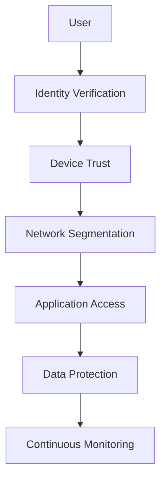

# 🌟 TAMV Enhanced Architecture v2.0
## Territorio Autónomo de Memoria Viva - Arquitectura Robusta y Segura

**Estado:** Arquitectura Mejorada con Funcionalidades Avanzadas  
**Versión:** 2.0  
**Principio:** Seguridad por Diseño, Escalabilidad Infinita, Ética Codificada

---

## 🎯 MEJORAS IMPLEMENTADAS

### 🔒 Seguridad Multicapa Avanzada
- **Zero Trust Architecture** con verificación continua
- **Hardware Security Modules (HSM)** para claves críticas
- **Quantum-Resistant Cryptography** preparado para el futuro
- **Multi-Factor Authentication** con biometría y hardware tokens
- **Threat Intelligence** integrada con feeds globales

### ⚡ Escalabilidad Infinita
- **Serverless-First Architecture** con auto-scaling
- **Multi-Region Deployment** con failover automático
- **Edge Computing** con CDN global
- **Microservicios Federados** con service mesh
- **Event-Driven Architecture** con mensajería asíncrona

### 🤖 IA Ética Avanzada
- **Explainable AI (XAI)** con transparencia total
- **Bias Detection** automático en decisiones
- **Ethical Guardrails** codificados e inmutables
- **Human-in-the-Loop** para decisiones críticas
- **Continuous Learning** con feedback ético

### 💰 Monetización Robusta
- **Stripe Integration** completa con 30+ métodos de pago
- **Multi-Currency Support** con conversión automática
- **Subscription Management** avanzado
- **Usage-Based Billing** con métricas en tiempo real
- **Revenue Sharing** automatizado y transparente

### 🌐 Infraestructura Global
- **Multi-Cloud Strategy** (AWS, Azure, GCP)
- **Kubernetes Orchestration** con Istio service mesh
- **Global Load Balancing** con health checks
- **Disaster Recovery** con RTO < 15 minutos
- **Compliance Automation** para múltiples jurisdicciones

---

## 🏗️ ARQUITECTURA TÉCNICA MEJORADA

### Capa de Presentación (Frontend)
```
React 18 + TypeScript + Tailwind CSS
├── Progressive Web App (PWA)
├── WebXR/WebVR Support
├── Real-time Collaboration
├── Offline-First Architecture
└── Accessibility (WCAG 2.1 AA)
```

### Capa de API Gateway
```
AWS API Gateway + CloudFront
├── Rate Limiting Inteligente
├── Request/Response Transformation
├── API Versioning
├── Circuit Breaker Pattern
└── Distributed Tracing
```

### Capa de Microservicios
```
Serverless Functions (Lambda)
├── Identity Service (DID + OAuth2)
├── Content Service (Media + Metadata)
├── Payment Service (Stripe + Billing)
├── AI Service (Isabella + XAI)
├── Blockchain Service (MSR + Consensus)
├── XR Service (Rendering + Physics)
├── Security Service (Tenochtitlan)
└── Analytics Service (Metrics + Insights)
```

### Capa de Datos
```
Multi-Database Strategy
├── DynamoDB (NoSQL - Escalabilidad)
├── PostgreSQL (ACID - Transacciones)
├── Redis (Cache - Performance)
├── S3 (Object Storage - Media)
├── IPFS (Distributed - Immutability)
└── Blockchain (Audit Trail - Trust)
```

### Capa de Seguridad
```
Zero Trust Security Model
├── AWS WAF (Web Application Firewall)
├── AWS Shield (DDoS Protection)
├── AWS GuardDuty (Threat Detection)
├── AWS Secrets Manager (Key Management)
├── AWS KMS (Encryption)
└── Custom Tenochtitlan System
```

---

## 🚀 COMPONENTES PRINCIPALES MEJORADOS

### 1. Sistema de Identidad Soberana (Enhanced DID)
- **Quantum-Resistant Keys** (Ed25519 + Post-Quantum)
- **Biometric Authentication** (Face + Fingerprint + Voice)
- **Hardware Token Support** (YubiKey + FIDO2)
- **Social Recovery** con guardianes de confianza
- **Privacy-Preserving** con Zero-Knowledge Proofs

### 2. Isabella AI v3.0 (Ethical AI Engine)
- **Multi-Modal Understanding** (Text + Image + Audio + Video)
- **Explainable Decisions** en 5 niveles de detalle
- **Bias Monitoring** continuo con alertas
- **Ethical Scoring** para todas las decisiones
- **Human Override** siempre disponible

### 3. Tenochtitlan Security v2.0 (Defense System)
- **Behavioral Analytics** con ML avanzado
- **Threat Intelligence** feeds en tiempo real
- **Automated Response** con escalación humana
- **Forensic Logging** inmutable
- **Incident Response** automatizado

### 4. XR Engine v2.0 (Immersive Experience)
- **WebXR Standard** completo
- **Real-time Ray Tracing** en navegador
- **Spatial Audio** 3D posicional
- **Haptic Feedback** avanzado
- **Cross-Platform** (VR/AR/Mobile/Desktop)

### 5. Blockchain MSR v2.0 (Trust Layer)
- **Sharding** para escalabilidad
- **Proof of Stake** más eficiente
- **Cross-Chain Bridges** a múltiples redes
- **Smart Contracts** con verificación formal
- **Carbon Neutral** con offsets automáticos

---

## 💡 NUEVAS FUNCIONALIDADES

### 🎓 Universidad TAMV (UTAMV) Completa
- **Cursos Interactivos** con XR
- **Certificaciones Blockchain** verificables
- **Profesores IA** especializados
- **Laboratorios Virtuales** para práctica
- **Títulos Reconocidos** internacionalmente

### 🏥 Salud Digital Avanzada
- **Telemedicina XR** con especialistas globales
- **Diagnóstico IA** asistido
- **Monitoreo Biométrico** continuo
- **Terapias Inmersivas** para salud mental
- **Farmacia Digital** con entrega global

### 🎮 Gaming Ecosystem
- **MMO Persistent Worlds** con física realista
- **Esports Tournaments** con premios reales
- **NFT Gaming Assets** intercambiables
- **Creator Economy** para desarrolladores
- **Cross-Platform Play** universal

### 📺 Streaming Platform
- **4K/8K Video** con compresión avanzada
- **Interactive Content** con decisiones del usuario
- **Live Events** con hasta 10M espectadores
- **Creator Monetization** múltiple
- **Global CDN** con latencia < 50ms

### 🏪 Marketplace Global
- **Physical + Digital** productos
- **AI-Powered Search** semántico
- **Augmented Reality** try-before-buy
- **Global Shipping** optimizado
- **Escrow Protection** automático

---

## 🔧 STACK TECNOLÓGICO COMPLETO

### Frontend Technologies
```typescript
// Core Framework
React 18 + TypeScript 5.0
Next.js 14 (App Router)
Tailwind CSS 3.4

// State Management
Zustand + React Query
Redux Toolkit (complex state)

// UI Components
Radix UI + Headless UI
Framer Motion (animations)
React Hook Form + Zod

// XR/3D
Three.js + React Three Fiber
WebXR Device API
A-Frame (declarative VR)

// Real-time
Socket.io + WebRTC
WebAssembly (performance)
Service Workers (offline)
```

### Backend Technologies
```python
# Serverless Functions
AWS Lambda + Python 3.11
FastAPI (high-performance APIs)
Pydantic (data validation)

# Databases
DynamoDB (NoSQL)
PostgreSQL 15 (ACID)
Redis 7 (caching)
Elasticsearch (search)

# Message Queues
AWS SQS + SNS
Apache Kafka (streaming)
EventBridge (event routing)

# AI/ML
TensorFlow 2.14
PyTorch 2.1
Hugging Face Transformers
OpenAI GPT-4 API
```

### Infrastructure as Code
```yaml
# AWS CDK (Python)
aws-cdk-lib 2.100+
constructs 10.3+

# Kubernetes
Kubernetes 1.28
Istio 1.19 (service mesh)
Helm 3.13 (package manager)

# Monitoring
Prometheus + Grafana
Jaeger (distributed tracing)
AWS CloudWatch
Datadog (APM)

# CI/CD
GitHub Actions
AWS CodePipeline
ArgoCD (GitOps)
Terraform (multi-cloud)
```

---

## 🛡️ SEGURIDAD AVANZADA

### Zero Trust Architecture


### Security Layers
1. **Perimeter Security** - WAF + DDoS Protection
2. **Network Security** - VPC + Security Groups
3. **Application Security** - OWASP Top 10 Protection
4. **Data Security** - Encryption at Rest + Transit
5. **Identity Security** - MFA + Biometrics
6. **Behavioral Security** - ML Anomaly Detection

### Compliance Frameworks
- **SOC 2 Type II** - Security Controls
- **ISO 27001** - Information Security
- **GDPR** - Data Protection (EU)
- **CCPA** - Consumer Privacy (California)
- **HIPAA** - Healthcare Data (US)
- **PCI DSS** - Payment Card Industry

---

## 📊 MÉTRICAS Y MONITOREO

### Performance Metrics
- **Response Time** < 100ms (API)
- **Page Load Time** < 2s (Frontend)
- **XR Frame Rate** > 90 FPS
- **Uptime** > 99.99%
- **Error Rate** < 0.01%

### Business Metrics
- **Monthly Active Users** (MAU)
- **Revenue per User** (ARPU)
- **Customer Acquisition Cost** (CAC)
- **Lifetime Value** (LTV)
- **Churn Rate** < 5%

### Security Metrics
- **Mean Time to Detection** (MTTD) < 5 min
- **Mean Time to Response** (MTTR) < 15 min
- **False Positive Rate** < 1%
- **Security Score** > 95%
- **Compliance Score** 100%

---

## 🌍 DESPLIEGUE GLOBAL

### Multi-Region Strategy
```
Primary Regions:
├── us-east-1 (N. Virginia) - Americas
├── eu-west-1 (Ireland) - Europe
├── ap-southeast-1 (Singapore) - Asia
└── sa-east-1 (São Paulo) - South America

Edge Locations:
├── 200+ CloudFront POPs
├── AWS Global Accelerator
├── Regional CDN Partners
└── Local ISP Caching
```

### Disaster Recovery
- **RTO** (Recovery Time Objective): < 15 minutes
- **RPO** (Recovery Point Objective): < 5 minutes
- **Multi-AZ Deployment** en todas las regiones
- **Cross-Region Replication** automática
- **Automated Failover** con health checks

---

## 🚀 ROADMAP DE IMPLEMENTACIÓN

### Fase 1: Fundación Robusta (Meses 1-3)
- [ ] Migración a arquitectura serverless
- [ ] Implementación de Zero Trust Security
- [ ] Integración completa con Stripe
- [ ] Setup de CI/CD avanzado
- [ ] Monitoreo y alertas

### Fase 2: Escalabilidad Global (Meses 4-6)
- [ ] Multi-region deployment
- [ ] Edge computing implementation
- [ ] Advanced caching strategies
- [ ] Performance optimization
- [ ] Load testing at scale

### Fase 3: IA y Automatización (Meses 7-9)
- [ ] Isabella AI v3.0 deployment
- [ ] Automated threat response
- [ ] Predictive scaling
- [ ] Intelligent routing
- [ ] ML-powered personalization

### Fase 4: Funcionalidades Avanzadas (Meses 10-12)
- [ ] Universidad TAMV completa
- [ ] Salud digital platform
- [ ] Gaming ecosystem
- [ ] Streaming platform
- [ ] Marketplace global

---

## 📈 PROYECCIONES DE CRECIMIENTO

### Usuarios y Engagement
- **2026**: 10M usuarios activos mensuales
- **2027**: 25M usuarios activos mensuales
- **2028**: 50M usuarios activos mensuales
- **2029**: 100M usuarios activos mensuales
- **2030**: 200M usuarios activos mensuales

### Revenue Projections
- **2026**: $100M ARR (Annual Recurring Revenue)
- **2027**: $250M ARR
- **2028**: $500M ARR
- **2029**: $1B ARR
- **2030**: $2B ARR

### Global Expansion
- **2026**: 50 países
- **2027**: 100 países
- **2028**: 150 países
- **2029**: 180 países
- **2030**: 195 países (cobertura global completa)

---

## 🤝 CONTRIBUCIÓN Y DESARROLLO

### Development Guidelines
- **Code Quality**: 90%+ test coverage
- **Security**: Automated security scanning
- **Performance**: Sub-100ms API responses
- **Documentation**: Comprehensive API docs
- **Accessibility**: WCAG 2.1 AA compliance

### Team Structure
- **Security Team**: 24/7 monitoring
- **DevOps Team**: Infrastructure automation
- **AI Ethics Team**: Responsible AI development
- **Compliance Team**: Regulatory adherence
- **Community Team**: User engagement

---

## 📄 LICENCIA Y GOVERNANCE

### Open Source Components
- **MIT License** para librerías base
- **Apache 2.0** para infraestructura
- **Creative Commons** para documentación

### Proprietary Components
- **TAMV Core Engine** - Proprietary
- **Isabella AI** - Proprietary
- **Tenochtitlan Security** - Proprietary
- **XR Rendering Engine** - Proprietary

### Governance Model
- **Technical Steering Committee** (TSC)
- **Security Advisory Board** (SAB)
- **Ethics Review Board** (ERB)
- **Community Council** (CC)

---

**© 2026 TAMV Holdings - Territorio Autónomo de Memoria Viva**  
**CEO Fundador:** Edwin Oswaldo Castillo Trejo (Anubis Villaseñor)  
**Contacto:** contact@tamv.world | https://tamv.world