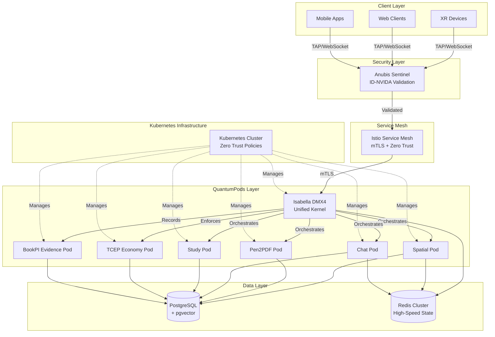

# Design Document: TAMV Hardened Backend (Mission-Critical Architecture)

## Overview

The TAMV Hardened Backend is a sovereign, mission-critical infrastructure built on QuantumPods microservices orchestrated by Isabella DMX4. This design implements a Zero Trust architecture with RTO/RPO < 10 minutes, ensuring TAMV operates independently of external cloud providers while maintaining enterprise-grade reliability.

The architecture consists of three primary layers:

1. **Identity & Security Layer**: Anubis Sentinel enforces Zero Trust with ID-NVIDA signature validation
2. **Orchestration Layer**: Isabella DMX4 unified kernel processes citizen intent across all capabilities
3. **Data Layer**: PostgreSQL with pgvector for civilizational memory, Redis for real-time state

All communication uses TAP (TAMV Action Protocol) over WebSockets for ultra-low latency real-time synchronization. The system enforces the 75/25 economic rule through TCEP and maintains immutable evidence through BookPI.

Key design principles:
- **Sovereignty**: Zero external dependencies, all processing on TAMV infrastructure
- **Resilience**: Automated failover, circuit breakers, and graceful degradation
- **Performance**: Sub-50ms processing for 95% of requests, support for 100,000+ concurrent users
- **Transparency**: All actions recorded in BookPI with cryptographic proof
- **Ethics**: Isabella audits all intents before execution

## Architecture

### High-Level Architecture Diagram



### Component Responsibilities

**Anubis Sentinel (Security Gateway)**
- Validates ID-NVIDA signatures on all incoming requests
- Enforces role-based access control
- Blocks unauthorized traffic before it reaches QuantumPods
- Logs all authentication attempts for security auditing

**Isabella DMX4 (Unified Kernel)**
- Receives multimodal intent through `/v1/kernel/intent`
- Analyzes citizen purpose using AI reasoning
- Orchestrates Spatial, Pen2PDF, Chat, Study capabilities
- Performs ethical auditing before execution
- Fuses multiple capabilities for complex intents

**QuantumPods (Microservices)**
- Spatial Pod: XR rendering and DreamSpace synchronization
- Pen2PDF Pod: Manuscript digitization and OCR
- Chat Pod: Conversational AI with ethical supervision
- Study Pod: Question generation and assessment
- TCEP Pod: Economic transaction processing with 75/25 rule
- BookPI Pod: Immutable evidence registry

**Data Layer**
- PostgreSQL + pgvector: Civilizational memory, vector search, persistent storage
- Redis Cluster: Real-time state, pub/sub for DreamSpaces, session management

**Istio Service Mesh**
- Mutual TLS for all pod-to-pod communication
- Traffic management and load balancing
- Distributed tracing and observability
- Circuit breaking and fault injection

## Components and Interfaces

### QuantumPod Base Architecture

All QuantumPods share a common architecture built on Node.js with Fastify:

```typescript
// Base QuantumPod structure
interface QuantumPodConfig {
  podName: string;
  port: number;
  healthCheckPath: string;
  tapEnabled: boolean;
  redisUrl: string;
  postgresUrl: string;
}

class QuantumPod {
  private fastify: FastifyInstance;
  private tapServer: TAPServer;
  private redis: RedisClient;
  private postgres: PostgresClient;
  
  constructor(config: QuantumPodConfig) {
    this.fastify = Fastify({
      logger: true,
      trustProxy: true,
      requestIdLogLabel: 'reqId',
    });
    
    // Register plugins
    this.fastify.register(fastifyWebsocket);
    this.fastify.register(fastifyHelmet);
    this.fastify.register(fastifyRateLimit);
    
    // Initialize TAP server if enabled
    if (config.tapEnabled) {
      this.tapServer = new TAPServer(this.fastify);
    }
    
    // Initialize data connections
    this.redis = new RedisClient(config.redisUrl);
    this.postgres = new PostgresClient(config.postgresUrl);
  }
  
  async start(): Promise<void> {
    await this.fastify.listen({ 
      port: this.port, 
      host: '0.0.0.0' 
    });
  }
  
  registerHealthCheck(): void {
    this.fastify.get('/health', async (request, reply) => {
      const redisHealth = await this.redis.ping();
      const postgresHealth = await this.postgres.ping();
      
      if (redisHealth && postgresHealth) {
        return { status: 'healthy', pod: this.config.podName };
      } else {
        reply.code(503);
        return { status: 'unhealthy', pod: this.config.podName };
      }
    });
  }
}
```

### TAP Protocol Implementation

TAP (TAMV Action Protocol) provides real-time bidirectional communication over WebSockets:

```typescript
// TAP Message Types
enum TAPMessageType {
  XR_EVENT = 'xr_event',
  DREAMSPACE_SYNC = 'dreamspace_sync',
  INTENT_REQUEST = 'intent_request',
  EVIDENCE_RECORD = 'evidence_record',
  ACK = 'ack',
  ERROR = 'error',
}

interface TAPMessage {
  id: string;
  type: TAPMessageType;
  timestamp: number;
  payload: any;
  signature?: string; // ID-NVIDA signature
}

class TAPServer {
  private connections: Map<string, WebSocket>;
  private redis: RedisClient;
  
  constructor(fastify: FastifyInstance) {
    this.connections = new Map();
    
    fastify.register(async (fastify) => {
      fastify.get('/tap', { websocket: true }, (connection, req) => {
        this.handleConnection(connection, req);
      });
    });
  }
  
  private async handleConnection(
    connection: WebSocket, 
    req: FastifyRequest
  ): Promise<void> {
    const connectionId = generateId();
    this.connections.set(connectionId, connection);
    
    connection.on('message', async (data: Buffer) => {
      const message = this.parseMessage(data);
      
      // Validate signature
      if (!this.validateSignature(message)) {
        this.sendError(connection, 'Invalid signature');
        return;
      }
      
      // Process message
      await this.processMessage(message, connectionId);
      
      // Send acknowledgment
      this.sendAck(connection, message.id);
    });
    
    connection.on('close', () => {
      this.connections.delete(connectionId);
    });
  }
  
  async broadcast(
    message: TAPMessage, 
    filter?: (connId: string) => boolean
  ): Promise<void> {
    const serialized = this.serializeMessage(message);
    
    for (const [connId, conn] of this.connections) {
      if (!filter || filter(connId)) {
        conn.send(serialized);
      }
    }
    
    // Also publish to Redis for cross-pod broadcasting
    await this.redis.publish('tap:broadcast', serialized);
  }
  
  private serializeMessage(message: TAPMessage): Buffer {
    // Use efficient binary serialization (MessagePack)
    return msgpack.encode(message);
  }
}
```

### Isabella DMX4 Unified Kernel

Isabella DMX4 orchestrates all capabilities based on citizen intent:

```typescript
interface Intent {
  tenantId: string;
  type: string;
  input: {
    type: 'text' | 'image' | 'spatial' | 'audio' | 'multimodal';
    data: any;
    context?: string;
  };
  safetyProfile: 'STRICT_DEKATEOTL' | 'STANDARD' | 'RESEARCH';
  jurisdiction: string;
}

interface IntentResponse {
  id: string;
  aiResponse: string;
  spatialData?: any;
  economy?: {
    tcepGenerated: number;
    impactFundAllocation: string;
  };
  evidenceHash: string;
}

class IsabellaDMX4 {
  private ethicalEngine: EthicalEngine;
  private spatialPod: SpatialPodClient;
  private pen2pdfPod: Pen2PDFPodClient;
  private chatPod: ChatPodClient;
  private studyPod: StudyPodClient;
  private tcepPod: TCEPPodClient;
  private bookpiPod: BookPIPodClient;
  private vectorMemory: VectorMemoryClient;
  
  async processIntent(intent: Intent): Promise<IntentResponse> {
    // Step 1: Ethical Audit
    const ethicalResult = await this.ethicalEngine.audit(intent);
    if (ethicalResult.score < 0.3) {
      throw new EthicalBlockError(ethicalResult.explanation);
    }
    
    // Step 2: Retrieve civilizational context
    const context = await this.vectorMemory.search(
      intent.input.data,
      { limit: 5, threshold: 0.7 }
    );
    
    // Step 3: Analyze intent and determine capabilities needed
    const analysis = await this.analyzeIntent(intent, context);
    
    // Step 4: Orchestrate capabilities
    const results = await this.orchestrateCapabilities(
      analysis.capabilities,
      intent,
      context
    );
    
    // Step 5: Fuse results
    const fusedResponse = this.fuseResults(results);
    
    // Step 6: Record in BookPI
    const evidenceHash = await this.bookpiPod.record({
      action: 'intent_processed',
      intent: intent,
      response: fusedResponse,
      ethicalScore: ethicalResult.score,
    });
    
    return {
      id: generateId(),
      aiResponse: fusedResponse.text,
      spatialData: fusedResponse.spatial,
      economy: fusedResponse.economy,
      evidenceHash,
    };
  }
  
  private async analyzeIntent(
    intent: Intent,
    context: VectorSearchResult[]
  ): Promise<IntentAnalysis> {
    // Use AI to understand what the citizen wants
    const prompt = this.buildAnalysisPrompt(intent, context);
    const analysis = await this.chatPod.analyze(prompt);
    
    return {
      purpose: analysis.purpose,
      capabilities: analysis.requiredCapabilities,
      priority: analysis.priority,
    };
  }
  
  private async orchestrateCapabilities(
    capabilities: string[],
    intent: Intent,
    context: VectorSearchResult[]
  ): Promise<Map<string, any>> {
    const results = new Map();
    
    // Execute capabilities in parallel when possible
    const promises = capabilities.map(async (capability) => {
      switch (capability) {
        case 'spatial':
          return ['spatial', await this.spatialPod.process(intent)];
        case 'pen2pdf':
          return ['pen2pdf', await this.pen2pdfPod.convert(intent.input.data)];
        case 'chat':
          return ['chat', await this.chatPod.respond(intent, context)];
        case 'study':
          return ['study', await this.studyPod.generate(intent)];
        default:
          throw new Error(`Unknown capability: ${capability}`);
      }
    });
    
    const settled = await Promise.allSettled(promises);
    
    for (const result of settled) {
      if (result.status === 'fulfilled') {
        const [key, value] = result.value;
        results.set(key, value);
      }
    }
    
    return results;
  }
}
```

### Anubis Sentinel Identity Gatekeeper

Anubis Sentinel enforces Zero Trust access control:

```typescript
interface IDNVIDASignature {
  identity: string;
  roles: string[];
  timestamp: number;
  signature: string;
}

class AnubisSentinel {
  private publicKeys: Map<string, string>;
  private auditLog: AuditLogger;
  
  async validateRequest(
    request: FastifyRequest
  ): Promise<ValidatedIdentity> {
    // Extract signature from header
    const signatureHeader = request.headers['x-id-nvida-signature'];
    if (!signatureHeader) {
      throw new UnauthorizedError('Missing ID-NVIDA signature');
    }
    
    // Parse and validate signature
    const signature = this.parseSignature(signatureHeader);
    const isValid = await this.verifySignature(signature);
    
    if (!isValid) {
      await this.auditLog.logFailedAuth(request.ip, signature.identity);
      throw new UnauthorizedError('Invalid signature');
    }
    
    // Check for revocation
    if (await this.isRevoked(signature.identity)) {
      throw new UnauthorizedError('Identity revoked');
    }
    
    // Log successful authentication
    await this.auditLog.logSuccessfulAuth(
      request.ip,
      signature.identity,
      signature.roles
    );
    
    return {
      identity: signature.identity,
      roles: signature.roles,
      authenticated: true,
    };
  }
  
  private async verifySignature(
    signature: IDNVIDASignature
  ): Promise<boolean> {
    const publicKey = this.publicKeys.get(signature.identity);
    if (!publicKey) {
      return false;
    }
    
    // Verify timestamp (prevent replay attacks)
    const now = Date.now();
    if (Math.abs(now - signature.timestamp) > 300000) { // 5 minutes
      return false;
    }
    
    // Verify cryptographic signature
    const message = `${signature.identity}:${signature.roles.join(',')}:${signature.timestamp}`;
    return crypto.verify(
      'sha256',
      Buffer.from(message),
      publicKey,
      Buffer.from(signature.signature, 'base64')
    );
  }
}
```

### BookPI Immutable Evidence Registry

BookPI provides tamper-evident storage for all actions:

```typescript
interface EvidenceRecord {
  hash: string;
  timestamp: number;
  actor: string;
  actionType: string;
  payload: any;
  previousHash: string;
}

class BookPIRegistry {
  private postgres: PostgresClient;
  private blockchain: BlockchainClient;
  
  async record(evidence: Omit<EvidenceRecord, 'hash' | 'previousHash'>): Promise<string> {
    // Get previous hash for chain integrity
    const previousHash = await this.getLatestHash();
    
    // Calculate evidence hash
    const hash = this.calculateHash({
      ...evidence,
      previousHash,
    });
    
    // Store in PostgreSQL
    await this.postgres.query(
      `INSERT INTO evidence_registry 
       (hash, timestamp, actor, action_type, payload, previous_hash)
       VALUES ($1, $2, $3, $4, $5, $6)`,
      [hash, evidence.timestamp, evidence.actor, evidence.actionType, 
       JSON.stringify(evidence.payload), previousHash]
    );
    
    // Anchor to blockchain for long-term immutability
    await this.blockchain.anchor(hash);
    
    return hash;
  }
  
  async verify(hash: string): Promise<VerificationResult> {
    const record = await this.postgres.query(
      `SELECT * FROM evidence_registry WHERE hash = $1`,
      [hash]
    );
    
    if (!record.rows.length) {
      return { valid: false, reason: 'Record not found' };
    }
    
    // Verify hash integrity
    const calculatedHash = this.calculateHash(record.rows[0]);
    if (calculatedHash !== hash) {
      return { valid: false, reason: 'Hash mismatch - tampered' };
    }
    
    // Verify chain integrity
    const chainValid = await this.verifyChain(hash);
    if (!chainValid) {
      return { valid: false, reason: 'Chain broken' };
    }
    
    return { valid: true, record: record.rows[0] };
  }
  
  private calculateHash(record: Partial<EvidenceRecord>): string {
    const data = JSON.stringify({
      timestamp: record.timestamp,
      actor: record.actor,
      actionType: record.actionType,
      payload: record.payload,
      previousHash: record.previousHash,
    });
    
    return crypto.createHash('sha256').update(data).digest('hex');
  }
}
```

### TCEP Economy Engine

TCEP enforces the 75/25 economic rule at the code level:

```typescript
interface Transaction {
  amount: number;
  currency: string;
  source: string;
  purpose: string;
}

interface AllocationResult {
  impactAllocation: number;
  operationsAllocation: number;
  impactFundAddress: string;
  evidenceHash: string;
}

class TCEPEngine {
  private readonly IMPACT_RATIO = 0.75;
  private readonly OPERATIONS_RATIO = 0.25;
  private bookpi: BookPIPodClient;
  
  async processTransaction(
    transaction: Transaction
  ): Promise<AllocationResult> {
    // Validate transaction
    this.validateTransaction(transaction);
    
    // Calculate allocations
    const impactAllocation = transaction.amount * this.IMPACT_RATIO;
    const operationsAllocation = transaction.amount * this.OPERATIONS_RATIO;
    
    // Verify allocation rule
    if (Math.abs((impactAllocation + operationsAllocation) - transaction.amount) > 0.01) {
      throw new AllocationError('75/25 rule violation');
    }
    
    // Execute allocation
    const impactFundAddress = await this.allocateToImpactFund(
      impactAllocation,
      transaction.currency,
      transaction.purpose
    );
    
    await this.allocateToOperations(
      operationsAllocation,
      transaction.currency
    );
    
    // Record in BookPI
    const evidenceHash = await this.bookpi.record({
      action: 'tcep_transaction',
      transaction,
      allocations: {
        impact: impactAllocation,
        operations: operationsAllocation,
      },
    });
    
    return {
      impactAllocation,
      operationsAllocation,
      impactFundAddress,
      evidenceHash,
    };
  }
  
  private validateTransaction(transaction: Transaction): void {
    if (transaction.amount <= 0) {
      throw new ValidationError('Amount must be positive');
    }
    
    if (!this.isSupportedCurrency(transaction.currency)) {
      throw new ValidationError(`Unsupported currency: ${transaction.currency}`);
    }
  }
}
```

## Data Models

### PostgreSQL Schema

```sql
-- Vector Memory for Isabella's civilizational context
CREATE EXTENSION IF NOT EXISTS vector;

CREATE TABLE civilizational_memory (
  id UUID PRIMARY KEY DEFAULT gen_random_uuid(),
  document_type VARCHAR(50) NOT NULL, -- 'CODEX', 'COMPENDIO', 'ISABELLA_DOC'
  content TEXT NOT NULL,
  embedding vector(1536), -- OpenAI embedding dimension
  metadata JSONB,
  created_at TIMESTAMP DEFAULT NOW(),
  updated_at TIMESTAMP DEFAULT NOW()
);

CREATE INDEX ON civilizational_memory USING ivfflat (embedding vector_cosine_ops)
  WITH (lists = 100);

-- Evidence Registry for BookPI
CREATE TABLE evidence_registry (
  hash VARCHAR(64) PRIMARY KEY,
  timestamp BIGINT NOT NULL,
  actor VARCHAR(255) NOT NULL,
  action_type VARCHAR(100) NOT NULL,
  payload JSONB NOT NULL,
  previous_hash VARCHAR(64),
  blockchain_anchor VARCHAR(255),
  created_at TIMESTAMP DEFAULT NOW()
);

CREATE INDEX idx_evidence_timestamp ON evidence_registry(timestamp DESC);
CREATE INDEX idx_evidence_actor ON evidence_registry(actor);
CREATE INDEX idx_evidence_action_type ON evidence_registry(action_type);

-- DreamSpace Sessions
CREATE TABLE dreamspace_sessions (
  id UUID PRIMARY KEY DEFAULT gen_random_uuid(),
  name VARCHAR(255) NOT NULL,
  creator VARCHAR(255) NOT NULL,
  state JSONB NOT NULL,
  participants JSONB NOT NULL,
  created_at TIMESTAMP DEFAULT NOW(),
  updated_at TIMESTAMP DEFAULT NOW(),
  expires_at TIMESTAMP
);

CREATE INDEX idx_dreamspace_creator ON dreamspace_sessions(creator);
CREATE INDEX idx_dreamspace_expires ON dreamspace_sessions(expires_at);

-- TCEP Transactions
CREATE TABLE tcep_transactions (
  id UUID PRIMARY KEY DEFAULT gen_random_uuid(),
  amount DECIMAL(20, 8) NOT NULL,
  currency VARCHAR(10) NOT NULL,
  source VARCHAR(255) NOT NULL,
  purpose TEXT,
  impact_allocation DECIMAL(20, 8) NOT NULL,
  operations_allocation DECIMAL(20, 8) NOT NULL,
  impact_fund_address VARCHAR(255),
  evidence_hash VARCHAR(64) REFERENCES evidence_registry(hash),
  created_at TIMESTAMP DEFAULT NOW()
);

CREATE INDEX idx_tcep_source ON tcep_transactions(source);
CREATE INDEX idx_tcep_created ON tcep_transactions(created_at DESC);

-- Audit Logs
CREATE TABLE audit_logs (
  id UUID PRIMARY KEY DEFAULT gen_random_uuid(),
  event_type VARCHAR(100) NOT NULL,
  actor VARCHAR(255) NOT NULL,
  ip_address INET,
  success BOOLEAN NOT NULL,
  details JSONB,
  created_at TIMESTAMP DEFAULT NOW()
);

CREATE INDEX idx_audit_actor ON audit_logs(actor);
CREATE INDEX idx_audit_created ON audit_logs(created_at DESC);
CREATE INDEX idx_audit_event_type ON audit_logs(event_type);
```

### Redis Data Structures

```typescript
// DreamSpace real-time state
interface DreamSpaceState {
  sessionId: string;
  participants: Set<string>;
  objects: Map<string, SpatialObject>;
  lastUpdate: number;
}

// Redis keys:
// dreamspace:{sessionId}:state - Hash of current state
// dreamspace:{sessionId}:participants - Set of participant IDs
// dreamspace:{sessionId}:events - List of recent events (capped)
// dreamspace:active - Set of active session IDs

// Session management
interface SessionData {
  userId: string;
  roles: string[];
  connectedAt: number;
  lastActivity: number;
}

// Redis keys:
// session:{sessionId} - Hash of session data (TTL: 24 hours)
// user:{userId}:sessions - Set of active session IDs

// Rate limiting
// Redis keys:
// ratelimit:{tenantId}:{endpoint}:{window} - Counter (TTL: window duration)

// Pub/Sub channels
// tap:broadcast - Global TAP message broadcasting
// dreamspace:{sessionId}:sync - DreamSpace-specific synchronization
// alerts:security - Security alerts
// alerts:performance - Performance alerts
```

### TypeScript Interfaces

```typescript
// Core domain models
interface Citizen {
  id: string;
  identity: string;
  roles: string[];
  tgnStake?: number;
  jurisdiction: string;
}

interface SpatialObject {
  id: string;
  type: string;
  position: { x: number; y: number; z: number };
  rotation: { x: number; y: number; z: number };
  scale: { x: number; y: number; z: number };
  metadata: Record<string, any>;
}

interface DreamSpace {
  id: string;
  name: string;
  creator: string;
  participants: Citizen[];
  objects: SpatialObject[];
  state: Record<string, any>;
  createdAt: Date;
  expiresAt: Date;
}

interface EthicalAuditResult {
  score: number; // 0.0 to 1.0
  principles: {
    dignity: number;
    transparency: number;
    fairness: number;
    accountability: number;
    beneficence: number;
    nonMaleficence: number;
    autonomy: number;
    justice: number;
  };
  risks: string[];
  explanation: string;
  approved: boolean;
}

interface VectorSearchResult {
  documentId: string;
  documentType: string;
  content: string;
  similarity: number;
  metadata: Record<string, any>;
}
```


## Correctness Properties

*A property is a characteristic or behavior that should hold true across all valid executions of a system—essentially, a formal statement about what the system should do. Properties serve as the bridge between human-readable specifications and machine-verifiable correctness guarantees.*

### Property Reflection

After analyzing all acceptance criteria, I identified the following redundancies:
- Requirements 4.1 and 4.2 both test signature validation (combined into Property 1)
- Requirements 6.2 and 6.3 both test the 75/25 rule (combined into Property 5)
- Requirements 3.4 and 15.1 both test ethical auditing (covered in Property 3)
- Requirements 3.5 and 15.3 both test ethical rejection (covered in Property 3)

The following properties provide comprehensive coverage without redundancy:

### Property 1: Signature Validation Enforcement

*For any* incoming request to the TAMV Hardened Backend, if the request lacks a valid ID-NVIDA signature, then Anubis Sentinel should block the request and prevent it from reaching any QuantumPod.

**Validates: Requirements 4.1, 4.2**

### Property 2: Role-Based Access Control

*For any* authenticated request with identity claims, the user should only be able to access resources and perform actions that match their assigned roles.

**Validates: Requirements 4.3**

### Property 3: Ethical Audit Precondition

*For any* intent submitted to Isabella DMX4, the intent must pass through ethical auditing before any processing occurs, and intents scoring below the ethical threshold (0.3) should be rejected with explanation.

**Validates: Requirements 3.4, 3.5, 15.1, 15.3**

### Property 4: Capability Orchestration Correctness

*For any* intent that requires multiple capabilities (Spatial, Pen2PDF, Chat, Study), Isabella DMX4 should invoke all required capabilities and return a unified response containing data from each invoked capability.

**Validates: Requirements 3.3, 3.6, 3.7**

### Property 5: TCEP 75/25 Rule Enforcement

*For any* transaction processed through TCEP, the allocation must be exactly 75% to impact and 25% to operations, and any transaction violating this rule should be rejected.

**Validates: Requirements 6.2, 6.3, 6.4**

### Property 6: BookPI Evidence Creation

*For any* action executed in the system (intent processing, transaction, authentication), an immutable evidence record with cryptographic hash must be created in BookPI.

**Validates: Requirements 5.1, 6.6, 15.6, 27.7**

### Property 7: Evidence Record Completeness

*For any* evidence record in BookPI, the record must contain timestamp, actor identity, action type, and outcome fields.

**Validates: Requirements 5.4**

### Property 8: Evidence Tamper Detection

*For any* evidence record in BookPI, if the record is tampered with, verification should detect the tampering and return a validation failure.

**Validates: Requirements 5.5**

### Property 9: TAP Message Acknowledgment

*For any* TAP message sent over WebSocket, an acknowledgment message should be received confirming delivery.

**Validates: Requirements 2.4**

### Property 10: WebSocket Reconnection with Exponential Backoff

*For any* WebSocket connection that drops, reconnection attempts should follow exponential backoff pattern (delays: 1s, 2s, 4s, 8s, ...).

**Validates: Requirements 2.5**

### Property 11: Unauthenticated TAP Rejection

*For any* WebSocket connection attempting to use TAP protocol, if the connection is not authenticated by Anubis Sentinel, all TAP messages should be rejected.

**Validates: Requirements 2.7**

### Property 12: Schema Validation Enforcement

*For any* incoming data to a QuantumPod, if the data does not match the expected schema, the data should be rejected with a validation error.

**Validates: Requirements 1.3**

### Property 13: Graceful Degradation on Dependency Failure

*For any* QuantumPod with unavailable dependencies, the QuantumPod should continue operating with reduced functionality rather than failing completely.

**Validates: Requirements 1.6**

### Property 14: Persistent WebSocket Connections for Active Sessions

*For any* active DreamSpace session, the WebSocket connections for all participants should remain open and persistent.

**Validates: Requirements 1.5**

### Property 15: Sovereignty - No External Requests

*For any* operation in the Sovereign Stack, no HTTP requests should be made to external cloud services or third-party APIs.

**Validates: Requirements 11.2**

### Property 16: Network Isolation Resilience

*For any* system state where external networks are unavailable, the Sovereign Stack should continue operating with full functionality using only local resources.

**Validates: Requirements 11.7**

### Property 17: Vector Memory Search Relevance

*For any* intent processed by Isabella, vector memory search should return context documents with similarity scores above the relevance threshold (0.7).

**Validates: Requirements 7.3**

### Property 18: Vector Memory Incremental Updates

*For any* new document added to civilizational memory, the document should be immediately searchable via vector similarity search.

**Validates: Requirements 7.7**

### Property 19: Redis Pub/Sub Message Delivery

*For any* message published to a Redis pub/sub channel, all active subscribers to that channel should receive the message.

**Validates: Requirements 8.3**

### Property 20: Session TTL Expiration

*For any* session stored in Redis with TTL, when the TTL expires, the session should be automatically removed from Redis.

**Validates: Requirements 8.6**

### Property 21: Critical State Persistence

*For any* critical state change in Redis, the state should also be persisted to PostgreSQL for durability.

**Validates: Requirements 8.7**

### Property 22: Command Function Authentication

*For any* request to a Command Function endpoint (/v1/kernel/intent, /v1/economy/tcep, etc.), the request must pass through Anubis Sentinel validation before processing.

**Validates: Requirements 13.7**

### Property 23: Multimodal Data Type Support

*For any* supported data type (text, base64 image, JSON spatial coordinates, audio), Isabella DMX4 should parse the data without errors.

**Validates: Requirements 14.1, 14.2**

### Property 24: Conflicting Data Type Clarification

*For any* intent with conflicting data types, Isabella DMX4 should request clarification from the citizen rather than making assumptions.

**Validates: Requirements 14.5**

### Property 25: Malicious Input Rejection

*For any* corrupted or malicious input data, Isabella DMX4 should reject the input and prevent processing.

**Validates: Requirements 14.6**

### Property 26: Multimodal Processing Logging

*For any* multimodal data processed by Isabella, a log entry should be created for debugging and improvement.

**Validates: Requirements 14.7**

### Property 27: Borderline Ethical Intent Flagging

*For any* intent with ethical score between 0.3 and 0.7, Isabella DMX4 should flag the intent for human guardian review rather than auto-approving or auto-rejecting.

**Validates: Requirements 15.4**

### Property 28: Circuit Breaker Opening on Repeated Failures

*For any* external dependency that fails repeatedly (3+ consecutive failures), the circuit breaker should open and prevent further calls to that dependency.

**Validates: Requirements 19.2**

### Property 29: Circuit Breaker Fallback Responses

*For any* circuit breaker in open state, requests should return fallback responses or cached data rather than propagating errors.

**Validates: Requirements 19.3**

### Property 30: Circuit Breaker Recovery

*For any* circuit breaker in open state, after a cooldown period, the circuit breaker should attempt to close by sending test requests to the dependency.

**Validates: Requirements 19.4**

### Property 31: Dependency Timeout Enforcement

*For any* call to a slow external dependency, if the call exceeds the timeout threshold, the call should be terminated and an error returned.

**Validates: Requirements 19.7**

### Property 32: DreamSpace State Initialization

*For any* new participant joining a DreamSpace, the participant should receive the complete current state of the DreamSpace for initialization.

**Validates: Requirements 27.3**

### Property 33: DreamSpace Conflict Resolution

*For any* simultaneous conflicting actions by multiple participants in a DreamSpace, the TAP protocol should resolve the conflict deterministically.

**Validates: Requirements 27.4**

### Property 34: DreamSpace Action History

*For any* action performed in a DreamSpace, the action should be recorded in the DreamSpace action history for replay and debugging.

**Validates: Requirements 27.5**

### Property 35: XR Event Physical Plausibility

*For any* XR event received by TAP, if the event violates physical plausibility constraints (e.g., impossible velocities, teleportation), the event should be rejected.

**Validates: Requirements 28.3**

### Property 36: XR Coordinate Transformation Correctness

*For any* XR event with coordinates in device coordinate system A, transforming to coordinate system B and back to A should produce equivalent coordinates (round-trip property).

**Validates: Requirements 28.4**

### Property 37: Authentication Attempt Logging

*For any* authentication attempt (successful or failed), Anubis Sentinel should create an audit log entry.

**Validates: Requirements 4.5**

### Property 38: Identity Revocation Enforcement

*For any* identity that has been revoked, all requests using that identity should be rejected by Anubis Sentinel.

**Validates: Requirements 4.7**

### Property 39: TCEP Currency Support

*For any* supported currency (BTC, USD, MXN, etc.), TCEP should correctly process transactions and apply the 75/25 allocation rule.

**Validates: Requirements 6.7**

## Error Handling

### Error Categories

The TAMV Hardened Backend implements structured error handling across four categories:

1. **Security Errors**: Authentication failures, authorization violations, signature validation failures
2. **Validation Errors**: Schema validation failures, malicious input detection, data integrity violations
3. **Ethical Errors**: Ethical audit failures, principle violations, guardian review requirements
4. **System Errors**: Dependency failures, timeout errors, circuit breaker activations

### Error Response Format

All errors follow a consistent JSON structure:

```typescript
interface ErrorResponse {
  error: {
    type: 'security' | 'validation' | 'ethical' | 'system';
    code: string;
    message: string;
    details?: any;
    requestId: string;
    timestamp: number;
  };
}
```

### Security Error Handling

**Signature Validation Failures**:
- Block request immediately at Anubis Sentinel
- Return 401 Unauthorized with error type 'security'
- Log failed attempt with IP address and attempted identity
- Trigger security alert if pattern indicates attack

**Authorization Violations**:
- Return 403 Forbidden with error type 'security'
- Include required roles in error details
- Log authorization failure for audit
- Do not expose internal role structure in error message

**Identity Revocation**:
- Return 401 Unauthorized with specific revocation message
- Log revocation attempt for security monitoring
- Provide contact information for identity recovery

### Validation Error Handling

**Schema Validation Failures**:
- Return 400 Bad Request with error type 'validation'
- Include specific schema violations in error details
- Provide examples of correct format when possible
- Log validation failures for API improvement

**Malicious Input Detection**:
- Return 400 Bad Request with generic message (avoid revealing detection logic)
- Log detailed information about malicious patterns detected
- Trigger security alert for potential attack
- Block IP address if repeated malicious attempts detected

**Data Integrity Violations**:
- Return 400 Bad Request with error type 'validation'
- Explain which integrity constraint was violated
- Suggest corrective actions when applicable

### Ethical Error Handling

**Ethical Audit Failures**:
- Return 403 Forbidden with error type 'ethical'
- Include ethical score and violated principles
- Provide explanation of why intent was rejected
- Record ethical block in BookPI for transparency

**Guardian Review Requirements**:
- Return 202 Accepted with error type 'ethical'
- Indicate that intent is pending guardian review
- Provide estimated review time
- Return review ticket ID for status checking

### System Error Handling

**Dependency Failures**:
- Return 503 Service Unavailable with error type 'system'
- Indicate which dependency is unavailable
- Provide fallback response when possible
- Include retry-after header with estimated recovery time

**Timeout Errors**:
- Return 504 Gateway Timeout with error type 'system'
- Indicate which operation timed out
- Suggest reducing request complexity or retrying
- Log timeout for performance analysis

**Circuit Breaker Activations**:
- Return 503 Service Unavailable with error type 'system'
- Indicate circuit breaker is open
- Provide fallback response or cached data when available
- Include estimated time until circuit breaker retry

### Error Recovery Strategies

**Automatic Retry with Exponential Backoff**:
- Applied to transient failures (network errors, temporary unavailability)
- Retry delays: 1s, 2s, 4s, 8s, 16s (max 5 retries)
- Include jitter to prevent thundering herd

**Graceful Degradation**:
- When non-critical dependencies fail, continue with reduced functionality
- Example: If vector memory is unavailable, process intent without civilizational context
- Clearly indicate degraded mode in response

**Circuit Breaker Pattern**:
- Open circuit after 3 consecutive failures
- Half-open state after 30-second cooldown
- Close circuit after 3 consecutive successes in half-open state

**Fallback Responses**:
- Return cached data when available
- Provide simplified responses when full processing unavailable
- Clearly indicate fallback mode in response metadata

## Testing Strategy

### Dual Testing Approach

The TAMV Hardened Backend requires both unit testing and property-based testing for comprehensive coverage:

**Unit Tests**: Verify specific examples, edge cases, and error conditions
- Test specific endpoint behaviors with known inputs
- Test error handling for specific failure scenarios
- Test integration points between components
- Test edge cases like empty inputs, boundary values, malformed data

**Property Tests**: Verify universal properties across all inputs
- Test that properties hold for randomly generated inputs
- Test invariants that should never be violated
- Test round-trip properties (serialization, coordinate transformations)
- Test security properties (authentication, authorization)

Both approaches are complementary and necessary. Unit tests catch concrete bugs with specific inputs, while property tests verify general correctness across the input space.

### Property-Based Testing Configuration

**Testing Library**: Use `fast-check` for TypeScript/Node.js property-based testing

**Test Configuration**:
- Minimum 100 iterations per property test (due to randomization)
- Seed-based reproducibility for failed tests
- Shrinking to find minimal failing examples
- Timeout of 30 seconds per property test

**Property Test Tagging**:
Each property test must include a comment referencing the design document property:

```typescript
// Feature: tamv-hardened-backend, Property 1: Signature Validation Enforcement
test('all requests without valid signatures are blocked', async () => {
  await fc.assert(
    fc.asyncProperty(
      fc.record({
        path: fc.constantFrom('/v1/kernel/intent', '/v1/economy/tcep'),
        body: fc.anything(),
        signature: fc.option(fc.string(), { nil: undefined }),
      }),
      async (request) => {
        const response = await makeRequest(request);
        if (!isValidSignature(request.signature)) {
          expect(response.status).toBe(401);
        }
      }
    ),
    { numRuns: 100 }
  );
});
```

### Unit Testing Strategy

**Test Organization**:
- One test file per QuantumPod component
- Separate test files for TAP protocol, Anubis Sentinel, BookPI, TCEP
- Integration test files for end-to-end flows

**Test Coverage Goals**:
- 80% code coverage minimum
- 100% coverage for security-critical code (Anubis Sentinel, TCEP)
- 100% coverage for ethical auditing logic

**Mocking Strategy**:
- Mock external dependencies (PostgreSQL, Redis) for unit tests
- Use in-memory implementations for fast test execution
- Use real dependencies for integration tests

**Example Unit Tests**:

```typescript
describe('IsabellaDMX4', () => {
  describe('processIntent', () => {
    it('should reject intents with ethical score below 0.3', async () => {
      const intent = createUnethicalIntent();
      await expect(isabella.processIntent(intent))
        .rejects.toThrow(EthicalBlockError);
    });
    
    it('should orchestrate multiple capabilities for complex intents', async () => {
      const intent = createComplexIntent();
      const response = await isabella.processIntent(intent);
      expect(response.spatialData).toBeDefined();
      expect(response.aiResponse).toBeDefined();
    });
    
    it('should create BookPI evidence for all processed intents', async () => {
      const intent = createValidIntent();
      const response = await isabella.processIntent(intent);
      expect(response.evidenceHash).toMatch(/^[a-f0-9]{64}$/);
      
      const evidence = await bookpi.verify(response.evidenceHash);
      expect(evidence.valid).toBe(true);
    });
  });
});

describe('AnubisSentinel', () => {
  describe('validateRequest', () => {
    it('should block requests without signatures', async () => {
      const request = createRequestWithoutSignature();
      await expect(anubis.validateRequest(request))
        .rejects.toThrow(UnauthorizedError);
    });
    
    it('should block requests with expired signatures', async () => {
      const request = createRequestWithExpiredSignature();
      await expect(anubis.validateRequest(request))
        .rejects.toThrow(UnauthorizedError);
    });
    
    it('should log all authentication attempts', async () => {
      const request = createValidRequest();
      await anubis.validateRequest(request);
      
      const logs = await auditLog.query({ type: 'auth' });
      expect(logs.length).toBeGreaterThan(0);
    });
  });
});

describe('TCEPEngine', () => {
  describe('processTransaction', () => {
    it('should enforce 75/25 allocation rule', async () => {
      const transaction = { amount: 100, currency: 'USD', source: 'test', purpose: 'test' };
      const result = await tcep.processTransaction(transaction);
      
      expect(result.impactAllocation).toBe(75);
      expect(result.operationsAllocation).toBe(25);
    });
    
    it('should reject transactions violating allocation rule', async () => {
      const transaction = { amount: 100, currency: 'USD', source: 'test', purpose: 'test' };
      // Simulate tampering with allocation logic
      jest.spyOn(tcep, 'calculateAllocation').mockReturnValue({ impact: 50, operations: 50 });
      
      await expect(tcep.processTransaction(transaction))
        .rejects.toThrow(AllocationError);
    });
  });
});
```

### Integration Testing

**End-to-End Flow Tests**:
- Test complete intent processing from WebSocket connection to BookPI evidence
- Test DreamSpace session lifecycle (join, sync, leave)
- Test TCEP transaction flow with BookPI recording
- Test failure scenarios with circuit breaker activation

**Performance Testing**:
- Load testing with 10,000 concurrent WebSocket connections
- Stress testing with 100,000 concurrent users (separate infrastructure test)
- Latency testing for TAP message processing (target: <50ms p95)
- Database query performance testing (target: <100ms p95)

**Security Testing**:
- Penetration testing for Anubis Sentinel
- Signature forgery attempts
- Replay attack testing
- SQL injection and XSS testing
- Rate limiting and DDoS protection testing

### Continuous Integration

**CI Pipeline**:
1. Lint and type checking (TypeScript strict mode)
2. Unit tests with coverage reporting
3. Property-based tests (100 iterations per property)
4. Integration tests with Docker Compose
5. Security scanning (npm audit, Snyk)
6. Container image scanning
7. Deploy to staging environment

**Quality Gates**:
- All tests must pass
- Code coverage ≥ 80%
- No high-severity security vulnerabilities
- No TypeScript errors
- Performance benchmarks within acceptable range

### Test Data Management

**Test Data Generation**:
- Use `fast-check` generators for property tests
- Use factory functions for unit test data
- Use realistic test data for integration tests
- Anonymize production data for testing (never use real PII)

**Test Database Management**:
- Use separate test databases (PostgreSQL, Redis)
- Reset database state between tests
- Use transactions for test isolation
- Seed test data for integration tests

### Monitoring and Observability in Tests

**Test Observability**:
- Collect metrics during integration tests
- Monitor resource usage (CPU, memory, network)
- Track test execution time trends
- Alert on test performance degradation

**Test Reporting**:
- Generate HTML coverage reports
- Generate property test shrinking reports
- Generate performance benchmark reports
- Publish test results to dashboard

## Deployment Architecture

### Kubernetes Deployment

```yaml
# Isabella DMX4 Deployment
apiVersion: apps/v1
kind: Deployment
metadata:
  name: isabella-dmx4
  namespace: tamv-hardened
spec:
  replicas: 3
  selector:
    matchLabels:
      app: isabella-dmx4
  template:
    metadata:
      labels:
        app: isabella-dmx4
        version: v1
    spec:
      serviceAccountName: isabella-dmx4
      securityContext:
        runAsNonRoot: true
        runAsUser: 1000
        fsGroup: 1000
      containers:
      - name: isabella-dmx4
        image: tamv/isabella-dmx4:latest
        ports:
        - containerPort: 3000
          name: http
        - containerPort: 3001
          name: websocket
        env:
        - name: NODE_ENV
          value: "production"
        - name: POSTGRES_URL
          valueFrom:
            secretKeyRef:
              name: database-credentials
              key: postgres-url
        - name: REDIS_URL
          valueFrom:
            secretKeyRef:
              name: database-credentials
              key: redis-url
        resources:
          requests:
            memory: "512Mi"
            cpu: "500m"
          limits:
            memory: "2Gi"
            cpu: "2000m"
        livenessProbe:
          httpGet:
            path: /health
            port: 3000
          initialDelaySeconds: 30
          periodSeconds: 10
        readinessProbe:
          httpGet:
            path: /health
            port: 3000
          initialDelaySeconds: 10
          periodSeconds: 5
```

### Service Mesh Configuration (Istio)

```yaml
# Mutual TLS Policy
apiVersion: security.istio.io/v1beta1
kind: PeerAuthentication
metadata:
  name: default
  namespace: tamv-hardened
spec:
  mtls:
    mode: STRICT

# Authorization Policy
apiVersion: security.istio.io/v1beta1
kind: AuthorizationPolicy
metadata:
  name: anubis-sentinel-authz
  namespace: tamv-hardened
spec:
  selector:
    matchLabels:
      app: isabella-dmx4
  action: CUSTOM
  provider:
    name: anubis-sentinel
  rules:
  - to:
    - operation:
        paths: ["/v1/*"]
```

### Zero Trust Network Policies

```yaml
# Deny all traffic by default
apiVersion: networking.k8s.io/v1
kind: NetworkPolicy
metadata:
  name: default-deny-all
  namespace: tamv-hardened
spec:
  podSelector: {}
  policyTypes:
  - Ingress
  - Egress

# Allow Isabella DMX4 to PostgreSQL
apiVersion: networking.k8s.io/v1
kind: NetworkPolicy
metadata:
  name: isabella-to-postgres
  namespace: tamv-hardened
spec:
  podSelector:
    matchLabels:
      app: isabella-dmx4
  policyTypes:
  - Egress
  egress:
  - to:
    - podSelector:
        matchLabels:
          app: postgresql
    ports:
    - protocol: TCP
      port: 5432
```

### Horizontal Pod Autoscaling

```yaml
apiVersion: autoscaling/v2
kind: HorizontalPodAutoscaler
metadata:
  name: isabella-dmx4-hpa
  namespace: tamv-hardened
spec:
  scaleTargetRef:
    apiVersion: apps/v1
    kind: Deployment
    name: isabella-dmx4
  minReplicas: 3
  maxReplicas: 50
  metrics:
  - type: Resource
    resource:
      name: cpu
      target:
        type: Utilization
        averageUtilization: 70
  - type: Resource
    resource:
      name: memory
      target:
        type: Utilization
        averageUtilization: 80
  behavior:
    scaleUp:
      stabilizationWindowSeconds: 60
      policies:
      - type: Percent
        value: 50
        periodSeconds: 60
    scaleDown:
      stabilizationWindowSeconds: 300
      policies:
      - type: Percent
        value: 10
        periodSeconds: 60
```

## Performance Considerations

### Latency Targets

- TAP message processing: <50ms (p95)
- Intent processing: <200ms (p95)
- Vector memory search: <100ms (p95)
- BookPI evidence creation: <50ms (p95)
- TCEP transaction processing: <100ms (p95)

### Throughput Targets

- WebSocket connections: 100,000+ concurrent
- TAP messages: 1,000,000+ messages/second
- Intent processing: 10,000+ intents/second
- Database queries: 50,000+ queries/second

### Optimization Strategies

**Fastify Optimizations**:
- Use `fast-json-stringify` for response serialization
- Enable HTTP/2 for multiplexing
- Use connection pooling for database connections
- Implement request coalescing for duplicate requests

**PostgreSQL Optimizations**:
- Use HNSW indexes for pgvector (faster than IVFFlat for <1M vectors)
- Partition large tables by time (evidence_registry, audit_logs)
- Use read replicas for query scaling
- Implement connection pooling with PgBouncer

**Redis Optimizations**:
- Use Redis Cluster for horizontal scaling
- Use pipelining for batch operations
- Implement client-side caching for hot data
- Use Redis Streams for event sourcing

**WebSocket Optimizations**:
- Use binary serialization (MessagePack) instead of JSON
- Implement message batching for high-frequency events
- Use compression for large messages
- Implement backpressure handling

## Security Hardening

### Defense in Depth

1. **Network Layer**: Zero Trust network policies, service mesh with mTLS
2. **Application Layer**: Anubis Sentinel signature validation, rate limiting
3. **Data Layer**: Encryption at rest, encrypted backups, access controls
4. **Audit Layer**: BookPI immutable evidence, comprehensive logging

### Security Best Practices

- No hardcoded credentials (use Kubernetes Secrets)
- Principle of least privilege for service accounts
- Regular security scanning of container images
- Automated vulnerability patching
- Security incident response procedures
- Regular penetration testing
- Security training for developers

### Compliance

- GDPR compliance through data minimization and right to erasure
- EU AI Act compliance through ethical auditing and transparency
- SOC 2 compliance through audit logging and access controls
- ISO 27001 compliance through security management system

## Disaster Recovery

### Backup Strategy

- PostgreSQL: Continuous WAL archiving + daily full backups
- Redis: RDB snapshots every 5 minutes + AOF for durability
- BookPI: Blockchain anchoring for long-term immutability
- Configuration: Version-controlled in Git, encrypted secrets in Vault

### Recovery Procedures

**RTO < 10 minutes**:
1. Detect failure via health checks (30 seconds)
2. Initiate automated failover (1 minute)
3. Restore from most recent backup (5 minutes)
4. Validate system health (2 minutes)
5. Route traffic to recovered system (1 minute)

**RPO < 10 minutes**:
- Backups every 5 minutes ensure maximum 5-minute data loss
- Hot standby replicas provide near-zero RPO for critical data
- BookPI blockchain anchoring provides immutable audit trail

### Disaster Recovery Testing

- Monthly DR drills to validate procedures
- Quarterly full-scale DR exercises
- Annual third-party DR audit
- Continuous monitoring of backup integrity
