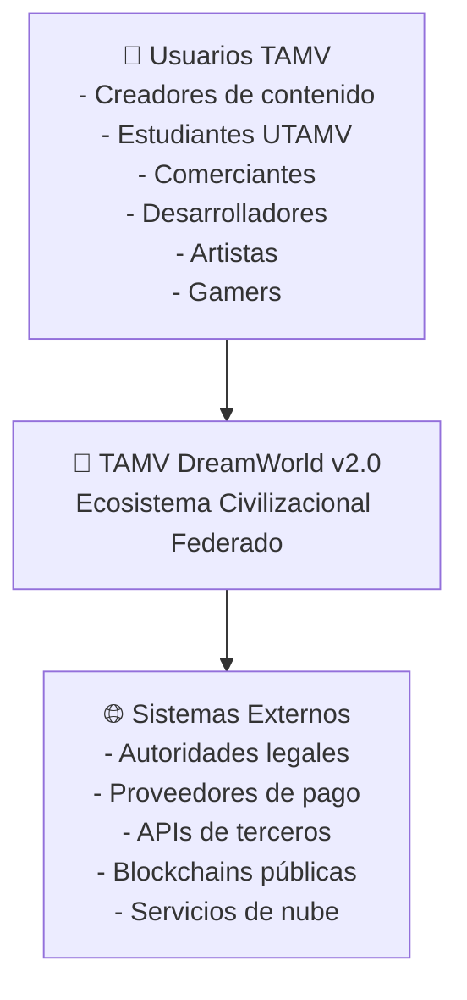
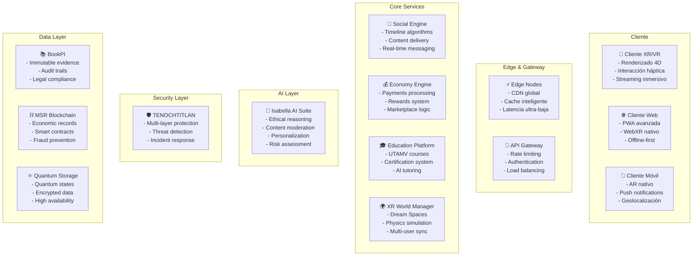
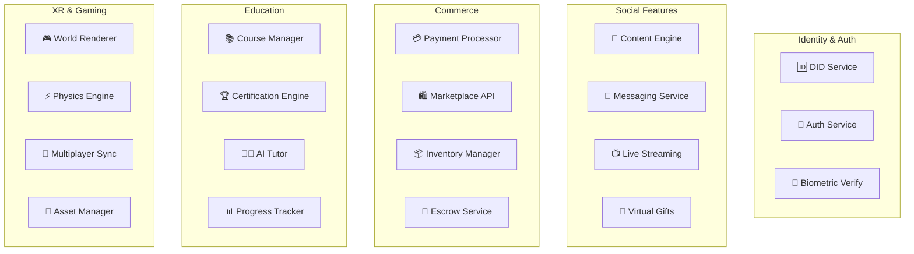

# 🌟 TAMV DreamWorld v2.0
## Documento Oficial Unificado (CTO + Legal)

**Estado:** Versión Ejecutable Completa  
**Fecha:** 2026-01-31  
**Naturaleza:** Documento técnico-jurídico vinculante (marco maestro)  
**CEO Fundador:** Edwin Oswaldo Castillo Trejo (Anubis Villaseñor)

---

## 🎯 1. Definición Ejecutiva

**TAMV DreamWorld v2.0** es el **primer ecosistema civilizacional federado antifrágil a nivel mundial**, una infraestructura digital privada transnacional que representa la evolución de todo lo conocido en la red. Es una plataforma integral que combina:

- **🌐 Red Social Avanzada** superior a todas las plataformas existentes
- **🔮 Entornos XR Habitables** con tecnología 4D nativa
- **🏛️ Universidad TAMV** con educación certificada
- **💰 Economía Digital Completa** con 30+ formas de monetización
- **🎨 Ecosistema Cultural** con arte, entretenimiento y espectáculos
- **🛡️ Seguridad TENOCHTITLAN** con protección multicapa
- **⚛️ Tecnología Quantum-Clásica** híbrida avanzada

### 🚫 TAMV NO es:
- Un Estado digital
- Una jurisdicción soberana  
- Una autoridad penal o regulatoria

### ✅ TAMV ES:
- **Plataforma privada** con alcance global
- **Infraestructura tecnológica** de vanguardia
- **Ecosistema económico digital** completo
- **Marco contractual avanzado** con cumplimiento legal
- **Civilización digital** con principios éticos inmutables

---

## 🏗️ 2. Arquitectura Técnica Oficial (CTO)

### 📊 2.1 Stack Tecnológico Completo

#### 🖥️ Cliente (Frontend)
```yaml
rendering:
  - WebGPU / WebGL2 (renderizado avanzado)
  - WebXR (realidad extendida nativa)
  - Custom 4D Renderer (dimensión temporal)
  - Ray Tracing en tiempo real
  - Physics Engine cuántico

authentication:
  - WebAuthn (autenticación biométrica)
  - DID (identidad descentralizada)
  - Multi-factor authentication
  - Blockchain identity verification

social_features:
  - Real-time messaging
  - Video/Audio streaming
  - Live broadcasting
  - Interactive stories
  - Virtual gifts system
```

#### 🌐 Red y Sincronización
```yaml
communication:
  - WebRTC (microgrupos P2P)
  - Edge Nodes regionales
  - CDN global distribuido
  - Autoridad de estado híbrida
  - Quantum-encrypted channels

streaming:
  - 4K/8K video streaming
  - Spatial audio 3D
  - Haptic feedback transmission
  - Low-latency gaming
  - Concert-quality audio
```

#### ⚙️ Backend (Microservicios)
```yaml
core_services:
  - Identity & Authentication Service
  - Social Network Engine
  - XR World Management
  - Economy & Payments Engine
  - Content Management System
  - Streaming & Media Service
  - Education Platform Service
  - Marketplace & Commerce
  - Gaming & Entertainment
  - AI & Moderation Service

data_layer:
  - Event Sourcing architecture
  - BookPI (memoria probatoria)
  - MSR (registro económico)
  - Distributed databases
  - Blockchain anchoring
  - Quantum state storage
```

#### 🤖 Capa de Inteligencia Artificial
```yaml
isabella_ai_suite:
  - Isabella-UX (experiencia de usuario)
  - Isabella-Risk (gestión de riesgos)
  - Isabella-EOCT (continuidad operativa)
  - Isabella-Narrative (generación de contenido)
  - Isabella-Moderation (moderación ética)
  - Isabella-Education (tutorías personalizadas)
  - Isabella-Commerce (recomendaciones comerciales)
  - Isabella-Health (bienestar digital)

ai_principles:
  - Ninguna IA tiene autoridad final ejecutiva
  - Supervisión humana obligatoria
  - Explicabilidad total (XAI)
  - Principios éticos inmutables
```

---

## 🌟 3. Servicios y Funcionalidades Completas

### 📱 3.1 Red Social Avanzada (Superior a TikTok/Instagram)

#### 🎬 Contenido Multimedia
- **📹 Videos HD/4K/8K** con edición avanzada integrada
- **📸 Fotos con filtros XR** y efectos cuánticos
- **🎞️ Reels interactivos** con elementos 3D/4D
- **📚 Historias persistentes** con línea temporal
- **🎵 Audio espacial** con calidad de estudio
- **🎮 Gaming integrado** con streaming en vivo

#### 💬 Comunicación Avanzada
- **💬 Chats privados** con cifrado cuántico
- **👥 Grupos temáticos** con hasta 100,000 miembros
- **📺 Canales de difusión** con suscripciones premium
- **🎙️ Salas de audio** tipo Clubhouse mejoradas
- **🔴 Live streaming** con interacción XR
- **🌐 Muro global** con algoritmo ético

#### 🎁 Sistema de Regalos Virtuales
```yaml
virtual_gifts:
  premium_gifts:
    - Joyas digitales NFT
    - Mascotas virtuales únicas
    - Efectos XR personalizados
    - Acceso a eventos exclusivos
    - Certificados de reconocimiento
  
  interactive_gifts:
    - Fuegos artificiales 4D
    - Portales dimensionales
    - Conciertos privados
    - Experiencias sensoriales
    - Mundos personalizados

  economic_impact:
    - 70% para el creador
    - 20% para la plataforma
    - 10% para el fondo comunitario
```

### 🎓 3.2 Universidad TAMV (UTAMV)

#### 📚 Programas Académicos
- **🔬 Ciencias Cuánticas** - Certificación internacional
- **🤖 Inteligencia Artificial Ética** - Especialización Isabella
- **🔮 Desarrollo XR/VR/AR** - Tecnologías inmersivas
- **⛓️ Blockchain y Criptoeconomía** - Finanzas descentralizadas
- **🏛️ Gobernanza Digital** - Sistemas federados
- **🎨 Arte Digital y NFTs** - Creación y comercialización
- **💼 Emprendimiento Digital** - Ecosistemas de negocio
- **🛡️ Ciberseguridad Avanzada** - Protección multicapa

#### 🎯 Metodología Educativa
```yaml
learning_approach:
  immersive_xr:
    - Laboratorios virtuales 4D
    - Simulaciones cuánticas
    - Experiencias históricas
    - Práticas en mundos digitales
  
  ai_tutoring:
    - Isabella como tutora personal
    - Adaptación al ritmo individual
    - Evaluación continua ética
    - Retroalimentación inmediata
  
  certification:
    - Blockchain-verified certificates
    - Industry recognition
    - Global accreditation
    - Career pathway mapping
```

### 🛍️ 3.3 Comercio y Marketplace

#### 🏪 Tienda Virtual Integral
- **👕 Moda Digital** - Ropa para avatares y física
- **🎨 Arte y Coleccionables** - NFTs y obras físicas
- **📱 Tecnología** - Dispositivos XR y accesorios
- **📚 Educación** - Cursos y certificaciones
- **🎮 Gaming** - Juegos y experiencias XR
- **🏠 Bienes Raíces Virtuales** - Espacios en DreamWorlds
- **💎 Lujo Digital** - Artículos premium exclusivos

#### 🤝 Marketplace P2P
```yaml
marketplace_features:
  seller_tools:
    - Tienda personalizable 3D
    - Analytics avanzados
    - Marketing automation
    - Inventory management
    - Customer relationship tools
  
  buyer_protection:
    - Escrow inteligente
    - Dispute resolution
    - Quality guarantees
    - Return policies
    - Fraud protection
  
  payment_methods:
    - TAMV Tokens
    - Criptomonedas principales
    - Monedas fiat
    - Pagos fraccionados
    - Subscripciones automáticas
```

### 🎭 3.4 Entretenimiento y Espectáculos

#### 🎵 Conciertos Sensoriales
- **🎼 Música en vivo** con artistas globales
- **🌈 Efectos visuales 4D** sincronizados
- **👥 Experiencias compartidas** hasta 1M usuarios
- **🎧 Audio espacial** con calidad de estudio
- **🤚 Interacción háptica** con la música
- **🎪 Eventos temáticos** personalizables

#### 🎬 Streaming Avanzado
```yaml
streaming_platform:
  content_types:
    - Películas XR interactivas
    - Series con múltiples finales
    - Documentales inmersivos
    - Shows de realidad virtual
    - Deportes en 360°
    - Eventos culturales globales
  
  features:
    - Watch parties virtuales
    - Comentarios en tiempo real
    - Subtítulos automáticos IA
    - Traducción simultánea
    - Accesibilidad completa
    - Offline viewing XR
```

### 🎨 3.5 Arte y Cultura

#### 🖼️ Galerías de Arte Virtuales
- **🏛️ Museos 4D** con obras históricas
- **🎨 Exposiciones interactivas** de artistas emergentes
- **💎 Subastas NFT** con certificación blockchain
- **🎭 Performances en vivo** en espacios virtuales
- **📚 Bibliotecas inmersivas** con conocimiento ancestral
- **🌍 Patrimonio cultural** digitalizado y preservado

#### 🏺 Preservación Cultural
```yaml
cultural_preservation:
  digital_heritage:
    - Monumentos históricos 3D
    - Tradiciones orales grabadas
    - Danzas y rituales inmersivos
    - Idiomas en peligro de extinción
    - Artesanías tradicionales
    - Cocina ancestral virtual
  
  community_involvement:
    - Creadores culturales certificados
    - Royalties a comunidades originarias
    - Educación cultural gratuita
    - Intercambio intercultural
    - Festivales globales virtuales
```

### 🏥 3.6 Salud y Bienestar

#### 💊 Servicios de Salud Digital
- **👨‍⚕️ Consultas médicas XR** con especialistas globales
- **🧘 Terapias inmersivas** para salud mental
- **💪 Fitness virtual** con entrenadores IA
- **🧠 Neuroplasticidad** con ejercicios cuánticos
- **❤️ Monitoreo biométrico** integrado con wearables
- **💊 Farmacia digital** con entrega global

#### 🧘 Bienestar Mental
```yaml
mental_health:
  therapeutic_spaces:
    - Jardines zen virtuales
    - Espacios de meditación 4D
    - Terapia de grupo inmersiva
    - Mindfulness con IA
    - Relajación sensorial
    - Comunidades de apoyo
  
  ai_assistance:
    - Isabella-Wellness coach
    - Detección temprana de estrés
    - Recomendaciones personalizadas
    - Crisis intervention protocols
    - Professional referrals
    - Progress tracking
```

### 📰 3.7 Noticias e Información

#### 📺 Centro de Noticias TAMV
- **🌍 Noticias globales** verificadas por IA
- **🔍 Fact-checking** automático con fuentes múltiples
- **📊 Análisis de tendencias** con visualización 4D
- **🎙️ Podcasts inmersivos** con expertos
- **📱 Alertas personalizadas** por intereses
- **🗳️ Cobertura electoral** imparcial y transparente

#### 🔬 Investigación Periodística
```yaml
journalism_platform:
  verification_tools:
    - Blockchain source verification
    - AI fact-checking algorithms
    - Cross-reference databases
    - Expert validation network
    - Community peer review
    - Transparency scoring
  
  content_creation:
    - Immersive storytelling tools
    - Data visualization 4D
    - Interactive infographics
    - Virtual press conferences
    - Citizen journalism platform
    - Whistleblower protection
```

### 💰 3.8 Finanzas y Economía

#### 🏦 Servicios Financieros Completos
- **💳 Banco digital TAMV** con servicios globales
- **📈 Trading de criptomonedas** con IA predictiva
- **💎 Inversiones en NFTs** y arte digital
- **🏠 Bienes raíces virtuales** como inversión
- **📊 Portfolio management** automatizado
- **💸 Remesas globales** instantáneas y baratas

#### 🎰 Lotería TAMV
```yaml
tamv_lottery:
  game_types:
    - Lotería tradicional semanal
    - Sorteos diarios menores
    - Mega jackpots mensuales
    - Lotería instantánea XR
    - Juegos de predicción IA
    - Sorteos comunitarios
  
  prize_structure:
    - 50% premios a ganadores
    - 30% fondo acumulativo
    - 15% desarrollo plataforma
    - 5% causas sociales
  
  transparency:
    - Blockchain-verified draws
    - Public random generation
    - Real-time audit trails
    - Community oversight
    - Regulatory compliance
```

### 🐾 3.9 Mascotas Digitales

#### 🦄 Ecosistema de Mascotas Virtuales
- **🐕 Mascotas únicas** generadas por IA
- **🧬 Genética digital** con herencia
- **🎮 Juegos interactivos** con mascotas
- **🏆 Competencias** y torneos
- **💊 Cuidado virtual** y evolución
- **🤝 Intercambio** y reproducción

#### 🎯 Características Avanzadas
```yaml
digital_pets:
  ai_behavior:
    - Personalidad única desarrollada
    - Aprendizaje de comportamientos
    - Interacción emocional real
    - Evolución basada en cuidado
    - Memoria a largo plazo
    - Vínculos con el dueño
  
  economic_value:
    - NFT ownership certificates
    - Breeding marketplace
    - Rare trait genetics
    - Competition prize pools
    - Sponsorship opportunities
    - Virtual pet services
```

### 🎮 3.10 Gaming y Entretenimiento

#### 🕹️ Plataforma de Juegos Integral
- **🎯 Juegos casuales** integrados en la red social
- **🏆 Esports profesionales** con torneos globales
- **🌍 MMORPGs** en mundos persistentes
- **🧩 Puzzle games** con recompensas TAMV
- **🎲 Casino virtual** regulado y transparente
- **🎪 Experiencias arcade** nostálgicas

#### 🏅 Sistema de Competencias
```yaml
gaming_ecosystem:
  tournament_system:
    - Daily micro-tournaments
    - Weekly themed competitions
    - Monthly championship series
    - Annual world championships
    - Celebrity exhibition matches
    - Community-organized events
  
  reward_structure:
    - TAMV token prizes
    - NFT trophies and badges
    - Exclusive cosmetic items
    - VIP platform privileges
    - Real-world merchandise
    - Sponsorship opportunities
```

### 👥 3.11 Programa de Referidos 500

#### 💰 Sistema de Incentivos Masivo
```yaml
referral_program_500:
  milestone_rewards:
    500_followers:
      bonus: $1000 USD
      requirements:
        - 500 paying subscribers
        - 90% retention rate
        - Community guidelines compliance
        - Content quality standards
      
    additional_milestones:
      1000_followers: $2500 USD
      5000_followers: $15000 USD
      10000_followers: $35000 USD
      50000_followers: $200000 USD
      100000_followers: $500000 USD
  
  qualification_criteria:
    - Original content creation
    - Positive community impact
    - Ethical behavior standards
    - Platform growth contribution
    - Mentor program participation
```

### 👨‍💻 3.12 Gremio TAMVDevs y HubDevs

#### 🛠️ Comunidad de Desarrolladores
- **💻 Herramientas de desarrollo** avanzadas
- **📚 Documentación completa** y tutoriales
- **🤝 Colaboración** en proyectos open source
- **🏆 Hackathons** mensuales con premios
- **🎓 Certificaciones** técnicas especializadas
- **💼 Bolsa de trabajo** exclusiva para miembros

#### 🌟 HubDevs - Centro de Innovación
```yaml
hubdevs_platform:
  development_tools:
    - XR/VR SDK completo
    - AI integration APIs
    - Blockchain development kit
    - Quantum computing simulators
    - 4D rendering engines
    - Social features SDK
  
  community_features:
    - Code review system
    - Mentorship matching
    - Project collaboration tools
    - Resource sharing library
    - Technical discussion forums
    - Innovation challenges
```

### 🌌 3.13 Dream Spaces

#### 🏰 Mundos Virtuales Personalizables
- **🏠 Espacios privados** completamente customizables
- **🌍 Mundos temáticos** para comunidades
- **🎭 Eventos especiales** en espacios únicos
- **🏛️ Arquitectura imposible** con física cuántica
- **🌈 Ambientes sensoriales** con efectos 4D
- **👥 Colaboración** en tiempo real

#### 🎨 Herramientas de Creación
```yaml
dream_spaces_creator:
  building_tools:
    - Drag-and-drop 3D editor
    - Physics simulation engine
    - Lighting and atmosphere control
    - Texture and material library
    - Animation and scripting tools
    - Collaborative editing mode
  
  monetization:
    - Space rental marketplace
    - Event hosting services
    - Custom design commissions
    - Template sales platform
    - Virtual real estate investment
    - Advertising space rental
```

### 🌉 3.14 Puentes de Conocimiento

#### 🔗 Conexiones Interdisciplinarias
- **🧠 IA que conecta** conceptos aparentemente no relacionados
- **📊 Visualización** de relaciones de conocimiento
- **🎓 Rutas de aprendizaje** personalizadas
- **👥 Colaboración** entre expertos globales
- **💡 Innovación** a través de conexiones inesperadas
- **📚 Biblioteca universal** interconectada

### 📢 3.15 Sección Especial para Publicidad

#### 🎯 Publicidad Ética y Efectiva
```yaml
advertising_platform:
  ad_formats:
    - Native XR experiences
    - Interactive 4D showcases
    - Sponsored content integration
    - Virtual product placements
    - Immersive brand experiences
    - Community-driven campaigns
  
  targeting_ethics:
    - Consent-based targeting only
    - Transparent data usage
    - User control over ads
    - No manipulation tactics
    - Educational value priority
    - Community benefit focus
  
  revenue_sharing:
    - 60% to content creators
    - 25% to platform operations
    - 10% to community fund
    - 5% to ad quality improvement
```

### 🆔 3.16 ID-NVIDA (Identidad Verificada)

#### 🔐 Sistema de Identidad Soberana
- **🎭 Avatares verificados** con biometría
- **📜 Certificaciones** profesionales y académicas
- **🏆 Logros** y reconocimientos verificables
- **🤝 Reputación** basada en interacciones reales
- **🛡️ Privacidad** con revelación selectiva
- **⚖️ Cumplimiento** legal internacional

---

## 🛡️ 4. Sistemas de Seguridad TENOCHTITLAN

### 🏰 4.1 Arquitectura de Seguridad Multicapa

#### 🔱 ANUBIS CENTINEL (Producción)
```yaml
anubis_layers:
  layer_1_identity:
    - DID + WebAuthn integration
    - Biometric verification
    - Behavioral analysis
    - Device fingerprinting
    - Geolocation consistency
  
  layer_2_traffic:
    - Real-time traffic analysis
    - Anomaly detection AI
    - Rate limiting adaptive
    - DDoS protection advanced
    - Bot detection quantum
  
  layer_3_access:
    - Zero-trust architecture
    - Purpose-based permissions
    - Time-bound access tokens
    - Context-aware authorization
    - Principle of least privilege
  
  layer_4_evidence:
    - Immutable audit trails
    - Blockchain anchoring
    - Non-repudiation proofs
    - Chain of custody tracking
    - Legal evidence standards
```

#### 👁️ HORUS CENTINEL (Shadow/Standby)
- **🔄 Arquitectura independiente** de ANUBIS
- **🧠 Modelos de amenaza** actualizados continuamente
- **⚡ Activación automática** en caso de falla de ANUBIS
- **🤖 Machine Learning** avanzado para nuevas amenazas
- **🔮 Predicción** de ataques futuros

#### 🏛️ DEKATEOTL (Orquestación Suprema)
- **🎯 11 capas de verificación** antes de cualquier acción crítica
- **👥 Consenso mínimo** requerido para decisiones importantes
- **🛑 Kill-switch ético** para situaciones extremas
- **⚖️ Cumplimiento constitucional** verificado automáticamente
- **👨‍⚖️ Supervisión humana** obligatoria para acciones críticas

#### 🏔️ AZTEK GODS (Cold Standby Absoluto)
- **❄️ Sistema dormido** que se activa solo en crisis extremas
- **🔒 22 capas de encriptación** para máxima seguridad
- **🌍 Distribución global** para resistir ataques coordinados
- **⚡ Activación instantánea** con autorización múltiple
- **🛡️ Protección civilizacional** para continuidad del ecosistema

---

## 📊 5. Diagramas C4 Completos

### 🌍 Nivel C1 — Contexto del Sistema


### 🏗️ Nivel C2 — Contenedores del Sistema


### ⚙️ Nivel C3 — Componentes Principales


---

## 🔒 6. STRIDE - Modelo de Amenazas Completo

| Amenaza | Descripción | Mitigación TAMV | Responsable |
|---------|-------------|-----------------|-------------|
| **Spoofing** | Suplantación de identidad | WebAuthn + DID + Biometría | ANUBIS CENTINEL |
| **Tampering** | Alteración de datos | Hash encadenado BookPI + Blockchain | MSR Chain |
| **Repudiation** | Negación de acciones | Evidencia probatoria inmutable | BookPI System |
| **Information Disclosure** | Filtración de datos | Cifrado cuántico + Minimización | TENOCHTITLAN |
| **Denial of Service** | Denegación de servicio | Rate limit + Edge + Auto-scaling | Edge Nodes |
| **Elevation of Privilege** | Escalada de privilegios | Principio menor privilegio + Zero Trust | DEKATEOTL |

### 🛡️ Controles de Seguridad Específicos

#### 🔐 Autenticación y Autorización
```yaml
auth_controls:
  multi_factor:
    - Biometric (fingerprint, face, voice)
    - Hardware tokens (FIDO2/WebAuthn)
    - Behavioral analysis
    - Device attestation
    - Location verification
  
  authorization:
    - Role-based access control (RBAC)
    - Attribute-based access control (ABAC)
    - Purpose-based permissions
    - Time-bound access tokens
    - Context-aware decisions
```

#### 🔍 Monitoreo y Detección
```yaml
monitoring_systems:
  real_time_detection:
    - Anomaly detection AI
    - Behavioral analysis
    - Network traffic monitoring
    - Application performance monitoring
    - Security event correlation
  
  threat_intelligence:
    - Global threat feeds
    - Community threat sharing
    - Predictive threat modeling
    - Zero-day vulnerability detection
    - Attack pattern recognition
```

---

## ⚖️ 7. Marco Legal y Cumplimiento

### 📜 7.1 Estatutos Corporativos TAMV Holdings

#### 🏛️ Estructura Corporativa
```yaml
corporate_structure:
  holding_company:
    name: "TAMV Holdings S.A. de C.V."
    jurisdiction: "México"
    registration: "Registro Público de Comercio"
    tax_id: "RFC-TAMV-2026"
  
  subsidiaries:
    tamv_tech: "Desarrollo tecnológico"
    tamv_edu: "Servicios educativos"
    tamv_media: "Contenido y entretenimiento"
    tamv_finance: "Servicios financieros"
    tamv_global: "Operaciones internacionales"
```

#### 👥 Órganos de Gobierno
- **👨‍💼 CEO Fundador**: Edwin Oswaldo Castillo Trejo (Anubis Villaseñor)
- **🏛️ Consejo de Administración**: 7 miembros independientes
- **⚖️ Comité Ético**: 5 expertos en ética digital
- **🛡️ Guardianías Técnicas**: Especialistas en cada área crítica
- **👥 Asamblea de Usuarios**: Representación comunitaria

### 📋 7.2 Términos y Condiciones (T&C)

#### ✅ Aceptación y Uso
```yaml
terms_conditions:
  acceptance:
    - Uso implica aceptación expresa
    - Términos actualizados con notificación
    - Derecho a rechazar cambios y salir
    - Consentimiento informado requerido
  
  user_rights:
    - Derecho a salida verificable
    - Derecho a explicación humana
    - Derecho a impugnación
    - Derecho a portabilidad de datos
    - Derecho al olvido (con limitaciones legales)
  
  platform_limits:
    - No garantiza ingresos específicos
    - No actúa como asesor financiero
    - No sustituye sistemas judiciales
    - No es responsable de decisiones de inversión
```

#### 🛡️ Protección de Usuarios
```yaml
user_protection:
  vulnerable_users:
    - Protección especial para menores
    - Detección de usuarios en riesgo
    - Intervención preventiva automática
    - Recursos de ayuda profesional
    - Escalación a autoridades cuando sea necesario
  
  content_moderation:
    - IA + revisión humana
    - Estándares comunitarios claros
    - Proceso de apelación transparente
    - Proporcionalidad en sanciones
    - Registro completo de decisiones
```

### 🌍 7.3 Cumplimiento Legal Internacional

#### 📊 Regulaciones Aplicables
```yaml
compliance_framework:
  data_protection:
    - GDPR (Unión Europea)
    - CCPA/CPRA (California, USA)
    - LGPD (Brasil)
    - PIPEDA (Canadá)
    - Ley Federal de Protección de Datos (México)
  
  financial_regulations:
    - PCI DSS (Pagos con tarjeta)
    - AML/KYC (Anti-lavado de dinero)
    - SOX (Transparencia financiera)
    - Regulaciones locales de fintech
  
  content_regulations:
    - DMCA (Derechos de autor USA)
    - DSA (Digital Services Act EU)
    - Ley de Derechos de Autor (México)
    - Regulaciones locales de contenido
```

#### 🤝 Cooperación con Autoridades
```yaml
legal_cooperation:
  valid_requests_only:
    - Orden legal válida requerida
    - Jurisdicción competente verificada
    - Principio de proporcionalidad aplicado
    - Debido proceso respetado
  
  prohibited_actions:
    - Vigilancia masiva sin orden
    - Cesión de datos sin base legal
    - Cooperación con regímenes autoritarios
    - Violación de derechos fundamentales
  
  transparency_reporting:
    - Reportes semestrales públicos
    - Estadísticas de solicitudes gubernamentales
    - Tipos de datos solicitados
    - Acciones tomadas por la plataforma
```

---

## 💰 8. Modelo Económico Completo

### 💎 8.1 Tokenomics TAMV

#### 🪙 TAMV Token (Utility Token)
```yaml
tamv_token:
  total_supply: 1_000_000_000 TAMV
  distribution:
    ecosystem_rewards: 40% (400M TAMV)
    development_fund: 20% (200M TAMV)
    team_and_advisors: 15% (150M TAMV)
    public_sale: 10% (100M TAMV)
    strategic_partnerships: 10% (100M TAMV)
    reserve_fund: 5% (50M TAMV)
  
  utility_functions:
    - Platform transaction fees
    - Premium feature access
    - Governance voting rights
    - Staking rewards
    - Creator monetization
    - Educational course payments
    - Virtual goods purchases
    - Advertising payments
```

#### 💰 Múltiples Formas de Monetización
```yaml
monetization_streams:
  content_creation:
    - Subscription tiers (Basic, Premium, VIP)
    - Pay-per-view content
    - Virtual gifts and tips
    - Sponsored content deals
    - Brand partnership programs
    - Merchandise sales integration
  
  education:
    - Course enrollment fees
    - Certification programs
    - Private tutoring sessions
    - Corporate training packages
    - Skill assessment services
    - Educational content licensing
  
  commerce:
    - Marketplace transaction fees
    - Payment processing fees
    - Advertising revenue share
    - Premium seller tools
    - Inventory management services
    - Logistics partnerships
  
  entertainment:
    - Event ticket sales
    - VIP experience packages
    - Gaming tournament entry fees
    - Virtual concert access
    - Exclusive content subscriptions
    - Celebrity meet-and-greets
  
  technology:
    - API usage fees
    - White-label solutions
    - Custom development services
    - Infrastructure hosting
    - Data analytics services
    - AI model licensing
```

### 📈 8.2 Programa de Referidos 500 Detallado

#### 🎯 Estructura de Incentivos
```yaml
referral_program_details:
  milestone_500:
    requirement: "500 paying subscribers"
    bonus: "$1,000 USD"
    additional_benefits:
      - Verified creator badge
      - Priority customer support
      - Advanced analytics access
      - Exclusive creator events
      - Mentorship program entry
  
  progression_tiers:
    tier_1_1k:
      followers: 1000
      bonus: "$2,500 USD"
      benefits: ["Custom branding", "API access"]
    
    tier_2_5k:
      followers: 5000
      bonus: "$15,000 USD"
      benefits: ["Revenue sharing boost", "Co-marketing opportunities"]
    
    tier_3_10k:
      followers: 10000
      bonus: "$35,000 USD"
      benefits: ["Dedicated account manager", "Custom features"]
    
    tier_4_50k:
      followers: 50000
      bonus: "$200,000 USD"
      benefits: ["Equity participation", "Board advisory role"]
    
    tier_5_100k:
      followers: 100000
      bonus: "$500,000 USD"
      benefits: ["Partnership opportunities", "Global ambassador role"]
```

---

## 🚀 9. Roadmap de Implementación

### 📅 Fase 1: Fundación (Q1-Q2 2026)
```yaml
phase_1_foundation:
  core_infrastructure:
    - ✅ Arquitectura base implementada
    - ✅ Sistemas de seguridad TENOCHTITLAN
    - ✅ Isabella AI básica
    - ✅ Identidad DID y autenticación
    - ✅ Blockchain MSR
  
  basic_features:
    - ✅ Red social básica
    - ✅ Mensajería y chat
    - ✅ Perfiles y contenido
    - ✅ Sistema de pagos
    - ✅ Marketplace básico
```

### 📅 Fase 2: Expansión (Q3-Q4 2026)
```yaml
phase_2_expansion:
  advanced_features:
    - 🔄 XR/VR completo con 4D
    - 🔄 Universidad TAMV lanzamiento
    - 🔄 Gaming y entretenimiento
    - 🔄 Conciertos sensoriales
    - 🔄 Dream Spaces personalizables
  
  ecosystem_growth:
    - 🔄 Programa de referidos 500
    - 🔄 Gremio TAMVDevs
    - 🔄 Mascotas digitales
    - 🔄 Lotería TAMV
    - 🔄 Servicios de salud digital
```

### 📅 Fase 3: Globalización (2027)
```yaml
phase_3_global:
  worldwide_expansion:
    - 🔮 Lanzamiento en 50+ países
    - 🔮 Soporte multiidioma completo
    - 🔮 Cumplimiento legal global
    - 🔮 Partnerships estratégicos
    - 🔮 IPO preparación
  
  advanced_ai:
    - 🔮 Isabella AI v3.0
    - 🔮 Quantum computing integration
    - 🔮 Predictive personalization
    - 🔮 Autonomous content creation
    - 🔮 Advanced threat prediction
```

---

## 🎯 10. Métricas de Éxito

### 📊 KPIs Principales
```yaml
success_metrics:
  user_growth:
    target_2026: "10 million active users"
    target_2027: "100 million active users"
    target_2028: "500 million active users"
  
  economic_impact:
    creator_earnings_2026: "$100 million distributed"
    creator_earnings_2027: "$1 billion distributed"
    platform_revenue_2026: "$50 million"
    platform_revenue_2027: "$500 million"
  
  educational_impact:
    utamv_students_2026: "100,000 enrolled"
    utamv_graduates_2026: "10,000 certified"
    course_completion_rate: ">85%"
    job_placement_rate: ">90%"
  
  technology_leadership:
    xr_session_time: ">2 hours average"
    ai_accuracy_rate: ">99%"
    security_incident_rate: "<0.01%"
    platform_uptime: ">99.99%"
```

---

## 🌟 11. Conclusión

**TAMV DreamWorld v2.0** representa la evolución definitiva de todo lo conocido en la red. Es el primer ecosistema civilizacional federado antifrágil que combina:

- **🏛️ Arquitectura civilizatoria** con 7 capas federadas
- **🔮 Tecnología de vanguardia** XR/VR/4D nativa
- **🤖 IA ética avanzada** con supervisión humana
- **💰 Economía digital completa** con 30+ formas de monetización
- **🛡️ Seguridad multicapa** TENOCHTITLAN
- **🎓 Educación certificada** Universidad TAMV
- **🌍 Alcance global** con cumplimiento legal

Este documento establece el marco técnico, legal y ético más avanzado jamás creado para una plataforma digital, diseñado para crear valor real sin sacrificar dignidad humana ni soberanía legal.

---

**📋 Documento Sellado — TAMV DreamWorld v2.0**  
**🗓️ Fecha:** 31 de enero de 2026  
**✍️ Firmado:** Edwin Oswaldo Castillo Trejo (Anubis Villaseñor)  
**🏛️ CEO Fundador TAMV Holdings**  
**🇲🇽 Orgullosamente Realmontense**

---

*"Donde la memoria limita al poder, y la dignidad dicta lo que la tecnología puede hacer."*