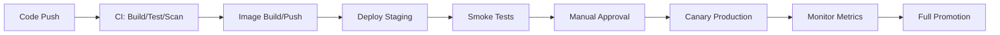

# 📋 RUNBOOK OPERACIONAL COMPLETO - TAMV ENHANCED
## Territorio Autónomo de Memoria Viva - Producción

**Versión:** Enhanced v2.0 + MD-X4 Integration  
**Fecha:** 2025-12-31  
**Estado:** Listo para Operaciones 24/7

---

## 🎯 DESCRIPCIÓN DEL ECOSISTEMA

### TAMV Online - Plataforma Inmersiva 4D
- **Renderizado 3D/4D** con proyecciones multidimensionales
- **Efectos multisensoriales** (audio espacial, haptics, iluminación)
- **Red social inmersiva** con interacciones físicas simuladas
- **Orquestación IA** (Isabella v3.0) para personalización tiempo real
- **Arquitectura de microservicios** (células independientes)
- **Observabilidad nativa** (Prometheus, Grafana, Tempo, Loki)

### Componentes Principales
```
tamv-core           → API Gateway + Orquestación
isabella-ai         → IA Ética + XAI + Recomendaciones  
xr-engine          → Renderizado 4D + WebXR + Física
blockchain-msr     → Trust Layer + Consensus + Audit
tenochtitlan-security → Defensa Multicapa + Threat Intel
quantum-processor  → Computación Híbrida + Optimización
```

---

## 👥 CONTACTOS Y ON-CALL

### Equipo Principal
- **SRE Lead:** sre-lead@tamv.world
- **DevLead IA:** ai-lead@tamv.world  
- **Security Lead:** security@tamv.world
- **Product Owner:** product@tamv.world
- **CEO:** Edwin Oswaldo Castillo Trejo

### Escalación de Incidentes
- **PagerDuty:** equipo-SRE-TAMV
- **Slack:** #tamv-incidents
- **Emergency:** +1-XXX-XXX-XXXX

### CODEOWNERS
```
/charts/*                    @SRETeam @DevTeam
/services/*                  @DevTeam @AITeam
/infra/*                     @SRETeam @InfraTeam
/security/*                  @SecurityTeam
/runbooks/*                  @SRETeam @DevOpsTeam
/docs/*                      @ProductTeam @DevTeam
```

---

## 🚀 FLUJOS DE DESPLIEGUE

### Pipeline CI/CD Completo


### Etapas Detalladas
1. **CI Pipeline**
   - Lint + Unit Tests + TypeCheck
   - Security scanning (Trivy + CodeQL)
   - Build + Bundle (prune devDeps)
   - Container image build/push

2. **Staging Deployment**
   - Helm upgrade automático
   - Health checks + smoke tests
   - Visual regression tests
   - Performance benchmarks

3. **Production Deployment**
   - Manual approval requerida
   - Canary deployment (10% tráfico)
   - Monitoring 15 minutos
   - Promoción gradual (50% → 100%)

### Comandos Clave
```bash
# Deploy staging
helm upgrade --install tamv-core ./charts/tamv-core \
  --namespace tamv-staging \
  --set image.tag=${IMAGE_TAG}

# Deploy production canary
helm upgrade --install tamv-core ./charts/tamv-core \
  --namespace tamv-prod \
  --set image.tag=${IMAGE_TAG} \
  --set canary.enabled=true \
  --set canary.weight=10

# Promote to full
helm upgrade tamv-core ./charts/tamv-core \
  --namespace tamv-prod \
  --set canary.weight=100
```

---

## 🔄 PROCEDIMIENTOS DE ROLLBACK

### Rollback Rápido (< 5 minutos)
```bash
# 1. Identificar versión anterior
helm history tamv-core -n tamv-prod

# 2. Rollback inmediato
helm rollback tamv-core <REVISION> --namespace tamv-prod

# 3. Verificar estado
kubectl rollout status deployment/tamv-core -n tamv-prod --timeout=300s

# 4. Validar health checks
kubectl get pods -n tamv-prod -l app=tamv-core
```

### Rollback con Validación
```bash
# 1. Rollback a staging primero
helm rollback tamv-core <REVISION> --namespace tamv-staging

# 2. Ejecutar smoke tests
./runbooks/scripts/smoke_test.sh tamv-staging tamv-core

# 3. Si OK, rollback producción
helm rollback tamv-core <REVISION> --namespace tamv-prod

# 4. Monitorear métricas 30 minutos
./runbooks/scripts/monitor_rollback.sh 1800
```

---

## 🚨 GESTIÓN DE INCIDENTES

### Incidente Crítico: Latencia Alta en Render 4D

#### Triggers de Alerta
- **p95 latency > 500ms** en endpoints de render
- **Error rate > 2%** en servicios XR
- **GPU utilization > 90%** sostenida
- **Frame rate < 60 FPS** en experiencias críticas

#### Procedimiento de Respuesta
```bash
# 1. Identificar pods con alto CPU/GPU
kubectl top pods -n tamv-prod --sort-by=cpu
kubectl top pods -n tamv-prod --sort-by=memory

# 2. Revisar logs recientes
kubectl logs deploy/xr-engine -n tamv-prod --since=1h --tail=200

# 3. Analizar traces en Tempo
# Acceder a Grafana → Explore → Tempo
# Query: {service_name="xr-engine"} | duration > 500ms

# 4. Escalar réplicas inmediatamente
kubectl scale deployment xr-engine --replicas=10 -n tamv-prod

# 5. Mover tráfico a nodos GPU adicionales
kubectl patch deployment xr-engine -n tamv-prod -p '
{
  "spec": {
    "template": {
      "spec": {
        "nodeSelector": {
          "node-type": "gpu-high-memory"
        }
      }
    }
  }
}'

# 6. Desactivar features experimentales
kubectl set env deployment/xr-engine -n tamv-prod \
  EXPERIMENTAL_FEATURES=false \
  ADVANCED_RENDERING=false

# 7. Si persiste, rollback
helm rollback xr-engine $(helm history xr-engine -n tamv-prod -o json | jq -r '.[1].revision') -n tamv-prod
```

#### Métricas de Monitoreo
```promql
# Latencia p95 render 4D
histogram_quantile(0.95, 
  rate(http_request_duration_seconds_bucket{service="xr-engine"}[5m])
)

# Error rate
rate(http_requests_total{status=~"5.."}[5m]) / 
rate(http_requests_total[5m]) * 100

# GPU utilization
nvidia_gpu_utilization_gpu{instance=~".*gpu.*"}

# Frame rate
avg(xr_frame_rate{service="xr-engine"})
```

---

## 🗄️ BACKUP Y RECOVERY

### Estrategia de Backup PostgreSQL
```yaml
# Configuración RDS
Backup Retention: 30 días (prod), 7 días (staging)
Backup Window: 03:00-04:00 UTC
Maintenance Window: Sunday 04:00-05:00 UTC
Multi-AZ: Enabled (prod)
Point-in-Time Recovery: Enabled
```

### Procedimiento de Restauración
```bash
# 1. Crear snapshot manual antes de restaurar
aws rds create-db-snapshot \
  --db-instance-identifier tamv-prod-postgres \
  --db-snapshot-identifier tamv-manual-$(date +%Y%m%d-%H%M%S)

# 2. Restaurar a instancia temporal
aws rds restore-db-instance-from-db-snapshot \
  --db-instance-identifier tamv-restore-temp \
  --db-snapshot-identifier tamv-snapshot-20251231

# 3. Ejecutar tests de integridad en staging
kubectl create job db-integrity-check --from=cronjob/db-maintenance -n tamv-staging

# 4. Planificar downtime para producción
# Notificar usuarios 24h antes
# Maintenance window: 2-4 AM UTC

# 5. Ejecutar restauración en producción
# Seguir procedimiento de DR documentado
```

### Scripts de Backup Automatizados
```bash
#!/bin/bash
# backup_database.sh
set -euo pipefail

TIMESTAMP=$(date +%Y%m%d_%H%M%S)
BACKUP_BUCKET="tamv-backups-prod"

# Crear dump de base de datos
kubectl exec -n tamv-prod deployment/tamv-core -- \
  pg_dump $DATABASE_URL > tamv_backup_${TIMESTAMP}.sql

# Subir a S3
aws s3 cp tamv_backup_${TIMESTAMP}.sql \
  s3://${BACKUP_BUCKET}/database/tamv_backup_${TIMESTAMP}.sql

# Limpiar backups antiguos (>30 días)
aws s3 ls s3://${BACKUP_BUCKET}/database/ | \
  awk '$1 < "'$(date -d '30 days ago' '+%Y-%m-%d')'" {print $4}' | \
  xargs -I {} aws s3 rm s3://${BACKUP_BUCKET}/database/{}
```

---

## 🔥 DEPLOY DE EMERGENCIA (HOTFIX)

### Procedimiento Acelerado
```bash
# 1. Crear rama hotfix
git checkout main
git pull origin main
git checkout -b hotfix/critical-security-fix

# 2. Implementar fix + tests
# ... código ...
git add .
git commit -m "hotfix: critical security vulnerability fix"

# 3. Push y crear PR
git push origin hotfix/critical-security-fix
gh pr create --title "HOTFIX: Critical Security Fix" \
  --body "Emergency fix for CVE-XXXX" \
  --reviewer @SRETeam,@SecurityTeam

# 4. Approval expedito (< 30 min)
# CodeOwner approval requerida

# 5. Merge a main
gh pr merge --squash

# 6. CI build automático
# Imagen tagged como: hotfix-YYYYMMDD-SHA

# 7. Deploy inmediato a producción
gh workflow run cd_canary.yml \
  -f image_tag=hotfix-20251231-abc123 \
  -f environment=production

# 8. Monitoreo intensivo 30 minutos
./runbooks/scripts/monitor_hotfix.sh 1800
```

### Criterios para Hotfix
- **Vulnerabilidades de seguridad** críticas
- **Data corruption** o pérdida de datos
- **Service outage** completo
- **Performance degradation** > 50%
- **Compliance violations** regulatorias

---

## 🔐 GESTIÓN DE SECRETOS

### Principios de Seguridad
- ❌ **NUNCA** guardar secretos en repositorio
- ✅ **External Secrets Operator** sincroniza desde Vault
- ✅ **Rotación automática** cada 90 días
- ✅ **JWT keys** rotación cada 30 días
- ✅ **Encryption at rest** y in transit

### Configuración External Secrets
```yaml
apiVersion: external-secrets.io/v1beta1
kind: SecretStore
metadata:
  name: vault-backend
  namespace: tamv-prod
spec:
  provider:
    vault:
      server: "https://vault.tamv.world"
      path: "secret"
      version: "v2"
      auth:
        kubernetes:
          mountPath: "kubernetes"
          role: "tamv-prod"
---
apiVersion: external-secrets.io/v1beta1
kind: ExternalSecret
metadata:
  name: tamv-core-secrets
  namespace: tamv-prod
spec:
  refreshInterval: 1h
  secretStoreRef:
    name: vault-backend
    kind: SecretStore
  target:
    name: tamv-core-secrets
    creationPolicy: Owner
  data:
  - secretKey: database-url
    remoteRef:
      key: tamv-prod/database
      property: url
  - secretKey: jwt-secret
    remoteRef:
      key: tamv-prod/auth
      property: jwt-secret
```

### Rotación de Secretos
```bash
#!/bin/bash
# rotate_secrets.sh
set -euo pipefail

echo "🔄 Iniciando rotación de secretos..."

# 1. Generar nuevos secretos
NEW_JWT_SECRET=$(openssl rand -base64 32)
NEW_API_KEY=$(openssl rand -hex 32)

# 2. Actualizar en Vault
vault kv put secret/tamv-prod/auth jwt-secret="$NEW_JWT_SECRET"
vault kv put secret/tamv-prod/api api-key="$NEW_API_KEY"

# 3. Forzar sincronización External Secrets
kubectl annotate externalsecret tamv-core-secrets -n tamv-prod \
  force-sync="$(date +%s)"

# 4. Rolling restart de servicios
kubectl rollout restart deployment/tamv-core -n tamv-prod
kubectl rollout restart deployment/isabella-ai -n tamv-prod

# 5. Verificar health checks
kubectl rollout status deployment/tamv-core -n tamv-prod --timeout=300s

echo "✅ Rotación de secretos completada"
```

---

## 📊 ESTRATEGIA DE MIGRACIONES DB

### Principios de Migración Segura
1. **No cambios destructivos** en una sola migración
2. **Scripts de rollback** donde sea posible
3. **Versionado semántico** + timestamps
4. **Testing en staging** con datos de producción

### Flujo Recomendado (5 Pasos)
```sql
-- Paso 1: Crear columnas nuevas (nullable)
ALTER TABLE users ADD COLUMN email_verified_v2 BOOLEAN DEFAULT NULL;
ALTER TABLE users ADD COLUMN verification_token_v2 VARCHAR(255) DEFAULT NULL;

-- Paso 2: Dual-write (app escribe en ambos campos)
-- Deploy aplicación que escriba en ambos campos

-- Paso 3: Backfill datos gradualmente
UPDATE users 
SET email_verified_v2 = email_verified,
    verification_token_v2 = verification_token
WHERE email_verified_v2 IS NULL
LIMIT 10000;

-- Paso 4: Cambiar lecturas a nuevos campos
-- Deploy aplicación que lea de nuevos campos

-- Paso 5: Eliminar columnas antiguas (release posterior)
ALTER TABLE users DROP COLUMN email_verified;
ALTER TABLE users DROP COLUMN verification_token;
ALTER TABLE users RENAME COLUMN email_verified_v2 TO email_verified;
ALTER TABLE users RENAME COLUMN verification_token_v2 TO verification_token;
```

### Herramientas de Migración
```json
{
  "scripts": {
    "migrate:up": "node-pg-migrate up",
    "migrate:down": "node-pg-migrate down",
    "migrate:create": "node-pg-migrate create",
    "migrate:test": "npm run migrate:up && npm run test:integration"
  }
}
```

### Job de Migración CI/CD
```yaml
- name: Run DB migrations
  run: |
    # Crear conexión temporal a staging
    kubectl port-forward svc/postgres 5432:5432 -n tamv-staging &
    sleep 5
    
    # Ejecutar migraciones
    npm run migrate:up
    
    # Tests de integridad
    npm run test:migration
    
    # Cleanup
    pkill -f "kubectl port-forward"
  env:
    DATABASE_URL: postgresql://tamv_user:${{ secrets.DB_PASSWORD }}@localhost:5432/tamv_staging
```

---

## 📋 CHECKLIST POST-INCIDENTE

### Documentación Obligatoria
```markdown
## Incident Report: INC-YYYY-NNNN

### Timeline
- **Detection:** YYYY-MM-DD HH:MM UTC
- **Response:** YYYY-MM-DD HH:MM UTC  
- **Mitigation:** YYYY-MM-DD HH:MM UTC
- **Resolution:** YYYY-MM-DD HH:MM UTC

### Impact
- **Users Affected:** X,XXX users
- **Services Down:** tamv-core, xr-engine
- **Duration:** XX minutes
- **Revenue Impact:** $X,XXX

### Root Cause
- **Primary:** Memory leak in XR rendering pipeline
- **Contributing:** Insufficient monitoring alerts
- **Detection:** Manual discovery by user reports

### Mitigation Steps
1. Scaled XR engine replicas from 3 to 10
2. Restarted affected pods
3. Applied memory limit patches
4. Rolled back to previous stable version

### Action Items
- [ ] Implement memory usage alerts (@SRETeam, 2025-01-15)
- [ ] Add automated memory leak detection (@DevTeam, 2025-01-20)
- [ ] Update runbook procedures (@SRETeam, 2025-01-10)
- [ ] Conduct post-mortem meeting (@AllTeams, 2025-01-05)

### Lessons Learned
- Need better proactive monitoring
- Memory limits too high for XR workloads
- Rollback procedures worked well
```

### Action Items Tracking
```bash
# Crear issues en GitHub para seguimiento
gh issue create \
  --title "Implement memory usage alerts for XR engine" \
  --body "Follow-up from INC-2025-001" \
  --assignee @SRETeam \
  --milestone "2025-Q1" \
  --label "incident-followup,monitoring"
```

---

## 🎯 TABLETOP EXERCISES

### Ejercicios Programados (2x año)
1. **Disaster Recovery Drill** (Enero/Julio)
2. **Security Incident Response** (Marzo/Septiembre)  
3. **Scaling Under Load** (Mayo/Noviembre)

### Escenarios de Simulación
```bash
# 1. Pérdida de nodo GPU
kubectl drain <gpu-node> --ignore-daemonsets --delete-emptydir-data

# 2. Subida masiva de tráfico (10x normal)
kubectl run load-test --image=loadimpact/k6 --rm -it -- \
  run --vus 10000 --duration 30m /scripts/load-test.js

# 3. Fallo de S3/CDN
# Simular con network policies
kubectl apply -f runbooks/simulations/block-s3-access.yaml

# 4. Database failover
# Forzar failover RDS Multi-AZ
aws rds reboot-db-instance \
  --db-instance-identifier tamv-prod-postgres \
  --force-failover
```

### Métricas de Éxito
- **RTO (Recovery Time Objective):** < 15 minutos
- **RPO (Recovery Point Objective):** < 5 minutos  
- **Team Response Time:** < 5 minutos
- **Communication:** Stakeholders notificados < 10 minutos

---

## 🛠️ COMANDOS ÚTILES

### Deployment y Scaling
```bash
# Deploy con tag específico
helm upgrade --install tamv-core ./charts/tamv-core \
  -n tamv-prod --set image.tag=v2.1.0

# Escalar servicio
kubectl scale deployment tamv-core --replicas=5 -n tamv-prod

# Status de rollout
kubectl rollout status deployment/tamv-core -n tamv-prod

# Historial de deployments
helm history tamv-core -n tamv-prod
```

### Debugging y Logs
```bash
# Logs en tiempo real
kubectl logs -f deployment/tamv-core -n tamv-prod --tail=100

# Logs de múltiples pods
kubectl logs -l app=tamv-core -n tamv-prod --since=1h

# Exec en pod
kubectl exec -it deployment/tamv-core -n tamv-prod -- /bin/bash

# Port forward para debugging
kubectl port-forward svc/tamv-core 3000:3000 -n tamv-prod
```

### Monitoring y Métricas
```bash
# Top pods por CPU/Memory
kubectl top pods -n tamv-prod --sort-by=cpu
kubectl top pods -n tamv-prod --sort-by=memory

# Describir recursos
kubectl describe pod <pod-name> -n tamv-prod
kubectl describe deployment tamv-core -n tamv-prod

# Events del namespace
kubectl get events -n tamv-prod --sort-by='.lastTimestamp'
```

---

## 📚 ANEXOS Y SCRIPTS

### Estructura de Scripts
```
runbooks/scripts/
├── smoke_test.sh           # Tests básicos de salud
├── monitor_canary.sh       # Monitoreo de canary
├── monitor_rollback.sh     # Monitoreo post-rollback
├── backup_database.sh      # Backup automatizado
├── rotate_secrets.sh       # Rotación de secretos
├── scale_for_load.sh       # Escalado automático
├── emergency_shutdown.sh   # Apagado de emergencia
└── health_check_all.sh     # Health check completo
```

### Dashboards Críticos
- **Infrastructure:** https://grafana.tamv.world/d/infra
- **Applications:** https://grafana.tamv.world/d/apps  
- **Business Metrics:** https://grafana.tamv.world/d/business
- **Security:** https://grafana.tamv.world/d/security

### Alertas Configuradas
```yaml
# Prometheus Rules
groups:
- name: tamv-critical
  rules:
  - alert: HighLatency
    expr: histogram_quantile(0.95, rate(http_request_duration_seconds_bucket[5m])) > 0.5
    for: 5m
    labels:
      severity: critical
    annotations:
      summary: "High latency detected"
      
  - alert: HighErrorRate  
    expr: rate(http_requests_total{status=~"5.."}[5m]) / rate(http_requests_total[5m]) > 0.02
    for: 2m
    labels:
      severity: critical
    annotations:
      summary: "High error rate detected"
```

---

## 🚀 PRÓXIMOS PASOS

### Mejoras Planificadas Q1 2025
- [ ] Implementar chaos engineering con Litmus
- [ ] Automatizar más procedimientos de recovery
- [ ] Mejorar alertas predictivas con ML
- [ ] Expandir coverage de tests de integración
- [ ] Implementar blue-green deployment completo

### Métricas de Mejora Continua
- **MTTR (Mean Time To Recovery):** Target < 10 minutos
- **MTBF (Mean Time Between Failures):** Target > 720 horas
- **Deployment Success Rate:** Target > 99.5%
- **Rollback Rate:** Target < 2%

---

**© 2025 TAMV Holdings - Territorio Autónomo de Memoria Viva**  
**Runbook Version:** Enhanced v2.0  
**Last Updated:** 2025-12-31  
**Next Review:** 2025-03-31