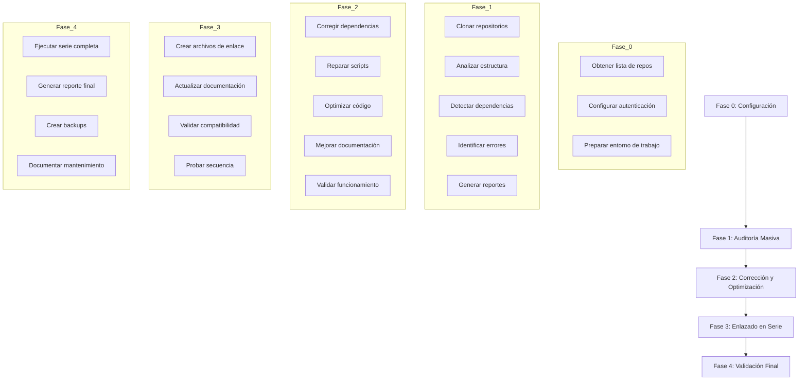

# Plan de Auditoría: 176 Repositorios Osopanda1

## Estado: PENDIENTE DE CLARIFICACIÓN

### Contexto Identificado

El workspace actual contiene el proyecto **TAMV (Territorio Autónomo de Memoria Viva)** consolidado, un ecosistema digital soberano que incluye:
- Red social avanzada
- Universidad TAMV (UTAMV)
- Sistema económico con token TAMV
- Gobernanza digital (Dekateotl DAO)
- Sistema de seguridad cuántica antifrágil
- Infraestructura XR/VR/3D/4D

**Fundador:** Edwin Oswaldo Castillo Trejo (Anubis Villaseñor)

---

## Preguntas Críticas para el Usuario

### 1. Acceso a los Repositorios
- [ ] ¿Los 176 repositorios están en `github.com/Osopanda1`?
- [ ] ¿Son repositorios públicos o privados?
- [ ] ¿Se proporcionará un token de acceso personal (PAT) de GitHub?

### 2. Relación con TAMV
- [ ] ¿El proyecto TAMV actual es uno de los 176 repositorios?
- [ ] ¿Los 176 repositorios deben integrarse dentro de TAMV?
- [ ] ¿O son un ecosistema separado que debe conectarse?

### 3. Orden del Flujo en Serie
- [ ] ¿Existe un orden predefinido para `Repo1 → Repo2 → ... → Repo176`?
- [ ] ¿Cómo se determina la secuencia?
- [ ] ¿Hay dependencias lógicas ya identificadas?

### 4. Tipo de Enlaces/Anclas
- [ ] ¿Los enlaces son dependencias técnicas (imports, APIs)?
- [ ] ¿Son enlaces de documentación (README links)?
- [ ] ¿Son archivos de configuración (JSON/YAML)?
- [ ] ¿Son pipelines de CI/CD?

### 5. Alcance de la Auditoría
- [ ] ¿Solo errores críticos que impiden ejecución?
- [ ] ¿También advertencias y malas prácticas?
- [ ] ¿Análisis completo de calidad de código?

### 6. Permisos y Ejecución
- [ ] ¿Kilo tiene permisos para hacer push directo?
- [ ] ¿O debe generar reportes para aplicación manual?

---

## Estructura Propuesta del Plan (Borrador)

---

## Entregables Esperados

1. **Reporte de Auditoría Global** (`reporte_auditoria_global.json`)
2. **Reportes Individuales por Repositorio** (`reportes/`)
3. **Repositorios Corregidos** (`repositorios_corregidos/`)
4. **Archivos de Enlace** (`link.json` por repositorio)
5. **Documentación Actualizada** (`README.md` por repositorio)
6. **Reporte Final Consolidado** (`reporte_final_global.json`)

---

## Próximos Pasos

1. Responder las preguntas críticas arriba
2. Proporcionar acceso a GitHub (token PAT si es necesario)
3. Confirmar el orden deseado de los repositorios
4. Aprobar el plan para proceder con la implementación

---

*Documento generado por Kilo Code - Arquitecto*
*Fecha: 2026-02-17*
